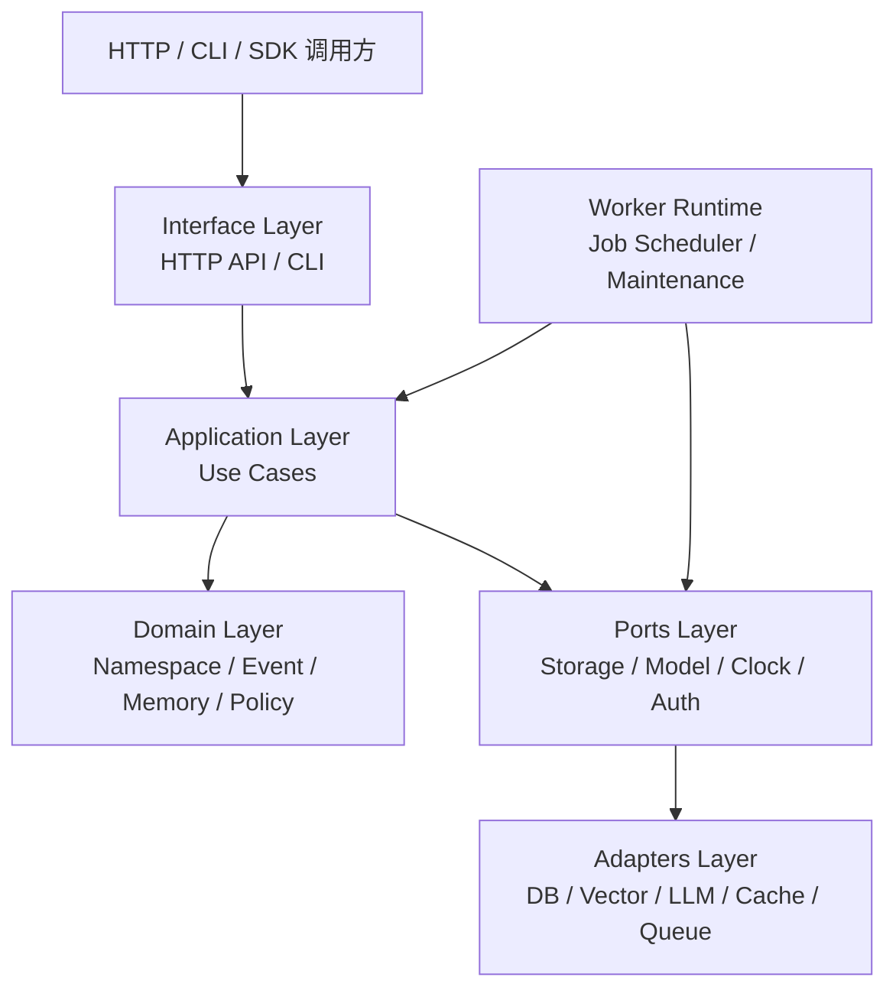
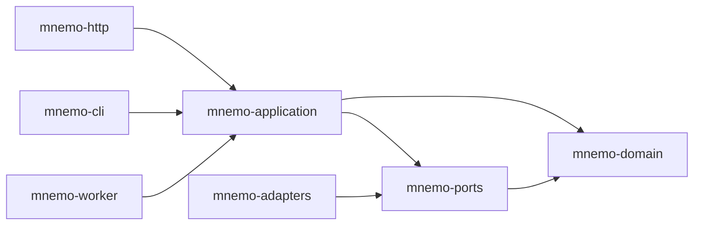
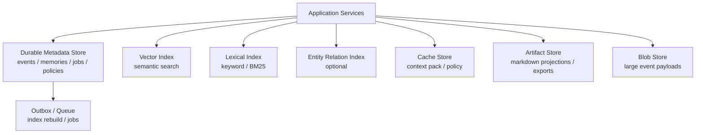
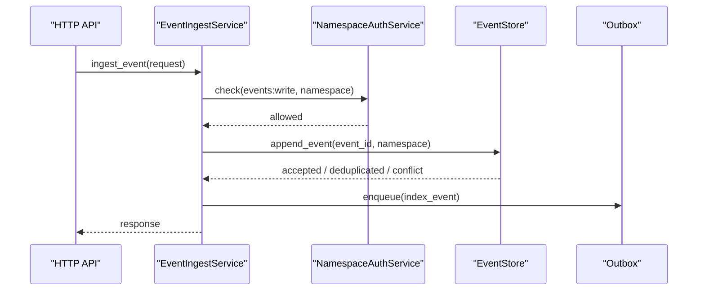
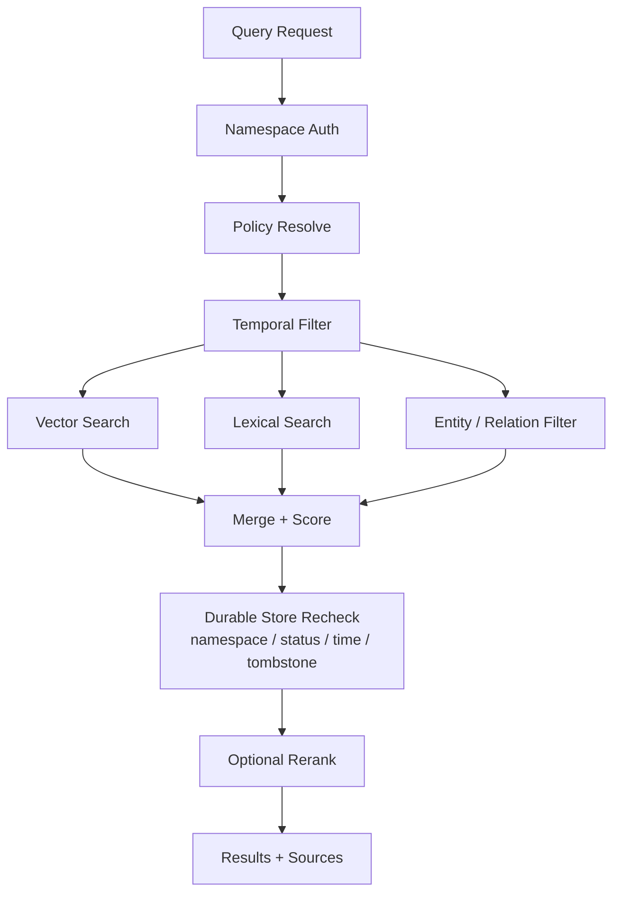

# Mnemo 记忆服务架构设计文档

状态：Draft  
日期：2026-05-10  
实现语言：Rust  
对应需求文档：`README.md`

## 1. 设计目标

Mnemo 是一个协议优先、旁路接入、带使用反馈闭环和时序记忆能力的通用 AI Agent 记忆服务。本设计文档基于 `README.md` 的外部协议要求，定义内部模块分层、核心流程、存储抽象和第一阶段实现边界。

本设计的核心目标：

- 对外保持稳定 HTTP/CLI 契约。
- 对内采用清晰分层，避免业务编排、存储实现、模型调用混在一起。
- 存储层必须抽象，允许不同部署形态替换事实存储、Markdown 投影、向量索引、全文索引、图谱索引、缓存和对象存储。
- 支持事件写入、显式记忆、查询、上下文包、会话整理、使用反馈、策略管理和遗忘。
- 为后续时序冲突解决、实体关系图谱、自动整理策略留出扩展点。

非目标：

- 第一阶段不强制实现完整知识图谱推理。
- 第一阶段不强制实现多模型自动路由。
- 第一阶段不把任意一个数据库、文件格式或向量库作为协议前提。
- 第一阶段不实现业务系统适配器，只提供通用 HTTP/CLI。

## 2. 参考 Mem0 的取舍

本地参考项目：`/home/wangyue.0925/workspace/github.com/mem0`

Mem0 中值得吸收的设计点：

- `Memory` 作为核心入口，统一提供 add/search/update/delete 等记忆能力。
- LLM、Embedding、Vector Store、Reranker 通过 provider/factory 创建，方便替换供应商。
- Vector Store 抽象清晰，支持多种后端，并提供 search、insert、update、delete、keyword_search、batch_search 等统一能力。
- 使用 history DB 记录记忆变更历史，便于审计和回溯。
- 搜索链路中结合向量检索、关键词/BM25、实体 boost、reranker，有利于召回质量。
- Entity Store 单独建集合，实体与 memory_id 建关联，给未来图谱能力留入口。
- REST server 层包含认证、限流、request_id、错误处理、配置管理等工程能力。

Mnemo 不直接照搬的点：

- Mem0 的主 `Memory` 类承担了过多编排逻辑。Mnemo 需要把写入、查询、整理、反馈、策略拆成独立应用服务。
- Mem0 默认偏向“从消息中抽取并写入向量库”。Mnemo 需要保留原始 Event Log 作为事实源，索引只是派生产物。
- Mem0 的 history DB 和 vector store 是不同责任，但在调用链里耦合较紧。Mnemo 需要通过 Storage Ports 明确事务和一致性边界。
- Mem0 的 entity 能力偏向辅助检索。Mnemo 需要把 Entity/Relation 设计成可选索引端口，不影响第一阶段主流程。

Mnemo 吸收后的设计原则：

- Provider 可插拔，但不要让 provider 侵入领域模型。
- 原始事件、长期记忆、索引、使用反馈、Job 状态分别建模。
- Durable Store 是事实源，Markdown Artifact、Search/Vector/Graph/Cache 都是可重建派生层。
- 后台整理通过 Job 和 Cursor 推进，不能依赖同步请求长时间阻塞。

## 3. 总体架构

Mnemo 采用六层架构：



各层职责：

| 层 | 职责 | 不做什么 |
|---|---|---|
| Interface | HTTP 路由、CLI 参数解析、请求校验、响应映射 | 不写业务规则 |
| Application | 编排 use case、权限校验、事务边界、Job 调度 | 不依赖具体数据库 SDK |
| Domain | 核心对象、状态机、时序语义、策略判断 | 不发网络请求 |
| Ports | 抽象接口，定义存储、索引、模型、缓存、队列能力 | 不包含具体实现 |
| Adapters | SQLite/Postgres/Markdown files/Qdrant/Tantivy/LLM 等实现 | 不绕过 Application |
| Workers | 后台整理、维护、重试、过期清理 | 不直接处理 HTTP |

## 4. Rust 工程结构

建议采用 workspace：

```text
mnemo/
  Cargo.toml
  crates/
    mnemo-domain/          # 领域模型和值对象
    mnemo-ports/           # trait 定义
    mnemo-application/     # use case 编排
    mnemo-adapters/        # 存储、索引、LLM、缓存实现
    mnemo-http/            # axum HTTP API
    mnemo-cli/             # clap CLI
    mnemo-worker/          # 后台 worker runtime
    mnemo-config/          # 配置加载与校验
    mnemo-telemetry/       # tracing / metrics / audit
```

依赖方向：



约束：

- `mnemo-domain` 第一阶段不依赖 async runtime、数据库、HTTP 框架；异步查询能力放在 ports 和 application 层。
- `mnemo-application` 只依赖 ports trait，不依赖具体 adapter。
- `mnemo-http` 负责 JSON schema 和错误映射，不直接访问 store。
- `mnemo-worker` 通过 application services 执行任务，不直接改库。

## 5. 核心模块

### 5.1 Interface Layer

模块：

- `http::routes::events`
- `http::routes::memories`
- `http::routes::query`
- `http::routes::context_pack`
- `http::routes::sessions`
- `http::routes::jobs`
- `http::routes::namespaces`
- `http::routes::usage`
- `http::routes::forget`

职责：

- 解析 `X-Request-ID`、`traceparent`、Bearer Token。
- 校验 JSON body、query params、pagination。
- 将 HTTP status 和 `error.code` 映射为统一错误结构。
- 将 namespace query params/body 统一转换为 `Namespace`.
- CLI namespace 字符串解析遵循需求文档中的 `tenant/user/workspace/thread/agent/source` 规则。
- 调用 application use case。

建议技术：

- HTTP：`axum`
- JSON schema：`serde` + `schemars` 可选
- CLI：`clap`
- tracing：`tracing` + `tracing-opentelemetry`

### 5.2 Application Layer

应用服务：

| 服务 | 核心职责 |
|---|---|
| `EventIngestService` | 单条/批量 Event 写入、幂等、cursor 分配 |
| `MemoryCommandService` | 显式记忆写入、更新、遗忘、状态变更 |
| `MemoryQueryService` | 查询编排、权限、时序过滤、索引召回、rerank |
| `ContextPackService` | 构建上下文包、缓存、token 预算、citation policy |
| `SessionWrapupService` | 创建 wrapup job、同步等待、返回 continuation context |
| `JobService` | Job 创建、领取、续租、完成、失败、查询 |
| `UsageService` | 使用反馈写入、排序/保留信号沉淀 |
| `PolicyService` | namespace policy 读取、继承、覆盖 |
| `NamespaceAuthService` | namespace canonicalization、token scope、scope expansion 和资源可见性校验 |
| `IdempotencyService` | 请求级幂等键记录、重放响应、冲突检测 |
| `MaintenanceService` | 过期清理、索引修复、冲突候选整理 |

Application 层控制事务边界。例如：

- `POST /v1/events`：权限校验 + 幂等检测 + Event 写入 + cursor 分配在一个 durable transaction 中完成。
- `POST /v1/memories`：Memory 写入、provenance 写入和 outbox enqueue 在一个 durable transaction 中完成；索引更新通过 outbox 异步完成。
- `POST /v1/forget`：Memory 状态变化、审计记录、索引失效任务必须同事务提交。

事务约束：

- Application 层必须从同一个 Durable Adapter 获取 `UnitOfWork`，并把同一个 transaction 传给该 adapter 暴露的多个 store。
- 同一个 use case 需要原子性时，不允许每个 store 各自开启独立 transaction。
- Outbox 任务写入属于 durable transaction 的一部分，不允许在事实提交后再单独 best-effort 写入。

资源可见性约束：

- 资源 ID 查询和更新必须先规范化请求 namespace，并校验 token scope。
- Store 查询应使用 `resource_id + canonical namespace` 或等价条件，避免先按全局 ID 查出资源再鉴权。
- 资源不存在、namespace 不匹配和无权访问统一映射为 `not_found`，降低存在性泄露风险。

幂等约束：

- `IdempotencyService` 使用 `token_id + canonical namespace + route + idempotency_key` 作为请求级幂等作用域。
- 幂等记录需要保存请求摘要、响应摘要、状态和过期时间。
- 同 key 同语义请求返回首次结果；同 key 不同语义请求返回 `idempotency_conflict`。
- Event 仍保留 `event_id` 作为事件级幂等主键，请求级幂等用于覆盖超时重试。

### 5.3 Domain Layer

核心对象：

- `Namespace`
- `Event`
- `Memory`
- `Provenance`
- `ContextPack`
- `UsageFeedback`
- `Job`
- `Policy`
- `Cursor`
- `Entity`
- `Relation`

关键领域规则：

- `Namespace` 只描述隔离边界，不隐式扩大范围。
- `Namespace` 在进入 Application 层前必须规范化；除 `tenant_id` 可默认 `default` 外，缺失字段不等价于 `*`。
- 普通记忆读写需要 canonical namespace 至少包含 `tenant_id + user_id`；tenant 级共享知识必须走专门权限。
- `EventId` 用于幂等和引用，不表达排序。
- `EventCursor` 是服务端 opaque token，不等于 event_id。
- `MemoryStatus` 控制查询可见性。
- `valid_from` / `valid_until` 控制时序有效性。
- `conflict_key` 和 `supersedes/superseded_by` 表达时序替代关系。
- `importance` 只能影响排序和保留，不能绕过权限或遗忘。

## 6. 存储层抽象

### 6.1 总体原则

存储层必须通过 ports 抽象：

- 不允许 application 直接依赖 SQL、Qdrant、Tantivy、Redis 等 SDK。
- 不允许 adapter 把自己的数据结构暴露到 domain。
- Durable Store 是事实源；Markdown 投影、向量索引、全文索引、图谱索引、缓存都可重建。
- 写路径优先保证事实源一致性，索引更新允许最终一致。
- 所有 store 方法必须携带或可推导 namespace 权限边界。

存储分层：



### 6.2 Store 类型

| Store | 是否事实源 | 第一阶段要求 | 可替换实现 |
|---|---:|---|---|
| `EventStore` | 是 | 必需 | SQLite/Postgres/MySQL |
| `MemoryStore` | 是 | 必需 | SQLite/Postgres/MySQL |
| `JobStore` | 是 | 必需 | SQLite/Postgres |
| `OutboxStore` | 是/派生任务事实 | 必需 | SQLite/Postgres |
| `IdempotencyStore` | 是 | 必需 | SQLite/Postgres |
| `PolicyStore` | 是 | 必需 | SQLite/Postgres |
| `UsageStore` | 是 | 必需 | SQLite/Postgres |
| `AuthStore` | 是 | 必需 | SQLite/Postgres/config file |
| `AuditStore` | 是 | 必需 | SQLite/Postgres/object log |
| `ArtifactStore` | 否 | 默认启用，可关闭 | local markdown files/S3/OSS |
| `VectorIndex` | 否 | 可选 | Qdrant/pgvector/Milvus/embedded |
| `LexicalIndex` | 否 | 可选 | Tantivy/Postgres FTS/Elastic |
| `EntityRelationIndex` | 否 | 预留 | Graph DB/Postgres tables |
| `CacheStore` | 否 | 可选 | in-memory/Redis |
| `BlobStore` | 是/辅助 | 可选 | local fs/S3/OSS |

### 6.3 Port Trait 草案

以下是接口形态草案，不要求最终代码逐字一致。

事务设计说明：

- `UnitOfWork` 必须和一组 durable stores 由同一个 adapter bundle 提供，例如 SQLite bundle 或 Postgres bundle。
- `Transaction` 是同一 bundle 内部共享的事务句柄包装；最终代码可以使用 associated type 或 adapter-specific transaction wrapper，避免跨 adapter 混用。
- `EventStore`、`MemoryStore`、`JobStore`、`OutboxStore`、`IdempotencyStore`、`PolicyStore`、`UsageStore`、`AuditStore` 在同一 use case 中共享同一个 transaction。
- Idempotency 记录、业务事实、audit 和 outbox enqueue 必须能在同一个 durable transaction 中提交，避免请求重试状态与业务状态不一致。
- 如果 store 收到不属于自身 bundle 的 transaction，必须返回稳定的 `StorageError::InvalidTransaction`，不能静默开启新事务。

```rust
#[async_trait::async_trait]
pub trait UnitOfWork {
    async fn begin(&self) -> Result<Box<dyn Transaction>, StorageError>;
}

#[async_trait::async_trait]
pub trait Transaction: Send {
    async fn commit(self: Box<Self>) -> Result<(), StorageError>;
    async fn rollback(self: Box<Self>) -> Result<(), StorageError>;
}
```

```rust
#[async_trait::async_trait]
pub trait EventStore: Send + Sync {
    async fn append_event(
        &self,
        tx: &mut dyn Transaction,
        namespace: &Namespace,
        event: NewEvent,
    ) -> Result<AppendEventResult, StorageError>;

    async fn get_event_range(
        &self,
        namespace: &Namespace,
        range: EventRange,
    ) -> Result<Vec<Event>, StorageError>;

    async fn namespace_status(
        &self,
        namespace: &Namespace,
    ) -> Result<NamespaceEventStatus, StorageError>;
}
```

```rust
#[async_trait::async_trait]
pub trait MemoryStore: Send + Sync {
    async fn create_memory(
        &self,
        tx: &mut dyn Transaction,
        namespace: &Namespace,
        memory: NewMemory,
    ) -> Result<Memory, StorageError>;

    async fn get_memory(
        &self,
        namespace: &Namespace,
        memory_id: &MemoryId,
    ) -> Result<Option<Memory>, StorageError>;

    async fn search_metadata(
        &self,
        query: MemoryMetadataQuery,
        page: PageRequest,
    ) -> Result<Page<Memory>, StorageError>;

    async fn update_memory(
        &self,
        tx: &mut dyn Transaction,
        namespace: &Namespace,
        patch: MemoryPatch,
    ) -> Result<Memory, StorageError>;

    async fn mark_forgotten(
        &self,
        tx: &mut dyn Transaction,
        namespace: &Namespace,
        target: ForgetTarget,
        mode: ForgetMode,
    ) -> Result<ForgetPlan, StorageError>;

    async fn hydrate_candidates(
        &self,
        namespace_scope: &AuthorizedNamespaceScope,
        candidate_ids: Vec<MemoryId>,
        visibility: MemoryVisibilityFilter,
    ) -> Result<Vec<Memory>, StorageError>;
}
```

```rust
#[async_trait::async_trait]
pub trait SearchIndex: Send + Sync {
    async fn upsert_memory(&self, memory: &MemoryIndexDocument) -> Result<(), IndexError>;
    async fn delete_memory(&self, namespace: &Namespace, memory_id: &MemoryId) -> Result<(), IndexError>;
    async fn query(&self, query: SearchIndexQuery) -> Result<Vec<SearchHit>, IndexError>;
}
```

`SearchIndex` 是 Vector/Lexical/EntityRelation 多路索引的查询门面。第一阶段可以用 mock 或 metadata fallback 实现，但 `SearchIndexQuery` 至少需要承载：

- `namespace` 和已授权的 `scope`。
- `query_text`，以及可选 embedding。
- `as_of`、`temporal_scope`、`validity_filter`。
- `filters`：`memory_type`、`origin`、`status`、`importance`、`tags`、`entity_ids`。
- `limit`、`page`、`min_score`。
- `purpose`、`response_format` 和 citation/provenance 需求。

```rust
#[async_trait::async_trait]
pub trait ArtifactStore: Send + Sync {
    async fn write_artifact(
        &self,
        namespace: &Namespace,
        artifact: ArtifactDocument,
    ) -> Result<ArtifactRef, ArtifactError>;

    async fn get_artifact(
        &self,
        namespace: &Namespace,
        artifact_id: &ArtifactId,
    ) -> Result<Option<ArtifactDocument>, ArtifactError>;

    async fn list_artifacts(
        &self,
        namespace: &Namespace,
        query: ArtifactQuery,
    ) -> Result<Vec<ArtifactRef>, ArtifactError>;
}
```

```rust
#[async_trait::async_trait]
pub trait JobStore: Send + Sync {
    async fn create_job(&self, tx: &mut dyn Transaction, job: NewJob) -> Result<Job, StorageError>;
    async fn claim_next_job(&self, worker_id: &str, lease: JobLease, scopes: &WorkerScopes) -> Result<Option<Job>, StorageError>;
    async fn heartbeat(&self, namespace: &Namespace, job_id: &JobId, lease_token: &str) -> Result<(), StorageError>;
    async fn complete(&self, namespace: &Namespace, job_id: &JobId, lease_token: &str, result: JobResult) -> Result<(), StorageError>;
    async fn fail(&self, namespace: &Namespace, job_id: &JobId, lease_token: &str, error: JobError) -> Result<(), StorageError>;
}
```

```rust
#[async_trait::async_trait]
pub trait ModelGateway: Send + Sync {
    async fn embed(&self, input: EmbedRequest) -> Result<Embedding, ModelError>;
    async fn embed_batch(&self, input: EmbedBatchRequest) -> Result<Vec<Embedding>, ModelError>;
    async fn extract_memories(&self, input: ExtractionRequest) -> Result<ExtractionResult, ModelError>;
    async fn summarize_context(&self, input: SummaryRequest) -> Result<SummaryResult, ModelError>;
    async fn rerank(&self, input: RerankRequest) -> Result<Vec<RerankHit>, ModelError>;
}
```

`model.*.provider = "disabled"` 时，Application 层应优先判断能力开关并避免调用模型能力。若仍调用 disabled adapter，adapter 必须返回稳定的 `ModelError::Disabled`，不得 panic 或返回空成功。

Port namespace 约束：

- 读写资源的 store 方法必须显式接收 `Namespace`、`AuthorizedNamespaceScope` 或包含等价信息的 query 对象。
- `memory_id`、`job_id` 等资源 ID 不能单独作为权限边界；store 层应支持 `resource_id + namespace` 查询。
- lease、heartbeat、complete、fail 等后台操作也必须校验 job namespace 或 worker scope，避免跨 namespace 操作任务。

### 6.4 一致性策略

写路径：

1. Durable Store 同事务提交事实。
2. Outbox 写入索引更新任务。
3. Worker 异步更新 Artifact/Vector/Lexical/Graph/Cache。
4. 查询时如果索引落后，可通过 `organized_cursor` 或 `index_cursor` 暴露诊断状态。

这样可以避免“写入成功但索引失败导致事实丢失”。Artifact 或索引失败只影响可读投影和召回新鲜度，不影响事实源。

### 6.5 Outbox 设计

Outbox 是 Durable Store 的一部分，用来把“事实提交”和“派生层更新”连接起来。

第一阶段约束：

- SQLite 模式下，Outbox 是 Durable Store 中的 `outbox_tasks` 表。
- 事实写入、审计写入和 outbox task enqueue 必须在同一个 durable transaction 中提交。
- Worker 通过 poll + lease 领取 outbox task，处理成功后标记 completed。
- Outbox 保证 at-least-once 投递，不保证 exactly-once；所有 handler 必须幂等。
- Outbox task 必须包含 `id`、`type`、`namespace`、`payload`、`idempotency_key`、`status`、`attempts`、`next_run_at`、`lease_owner`、`lease_until`、`last_error`、`created_at`、`updated_at`。

常见任务类型：

- `index_memory`
- `delete_memory_index`
- `refresh_artifact`
- `refresh_context_pack`
- `forget_cascade`
- `repair_index`

### 6.6 第一阶段默认适配器

第一阶段默认实现只提供一套稳定可运行配置：

| 存储端口 | 默认实现 | 是否事实源 | 说明 |
|---|---|---:|---|
| Durable Store | SQLite | 是 | 保存 Event、Memory、Job、Policy、Usage、权限和审计数据 |
| Artifact Store | local Markdown files | 否 | 生成可读投影、索引文件、导出文件和轻量工具兼容文件 |
| VectorIndex | disabled | 否 | 默认关闭；需要语义召回时再启用 Qdrant、pgvector 或内嵌向量索引 |
| LexicalIndex | disabled 或 Durable Store 退化查询 | 否 | 默认不强制 Tantivy；可先用 metadata/search 兜底 |
| EntityRelationIndex | disabled | 否 | 只保留协议和端口，不实现图谱推理 |
| CacheStore | in-memory | 否 | 缓存 context pack、policy 等可重建结果 |
| BlobStore | local fs，可选 | 辅助 | 仅在大文本、附件或导入文件需要时启用 |

说明：

- SQLite 是第一阶段事实源，Markdown 文件不是事实源。
- Markdown 文件由 Durable Store 和整理任务生成，可以删除后重建。
- 以上只是默认 adapter，不进入外部协议；调用方不能依赖内部表结构或文件布局。
- 后续服务化部署可替换为 Postgres Durable Store、对象存储 Artifact Store、Qdrant/pgvector VectorIndex、Tantivy/Postgres FTS LexicalIndex 和 Redis Cache。
- 所有 adapter 必须通过同一 ports 测试套件验证行为一致性。

### 6.7 Markdown Artifact Store

Artifact Store 用来承接文件型记忆工作流，但它在默认架构中是派生层。

第一阶段建议生成以下 Markdown 投影：

| 文件类型 | 用途 |
|---|---|
| `profile.md` | 当前 namespace 下的高信号长期画像和偏好摘要 |
| `periods/YYYY-MM.md` | 按时间段归档的事件与整理摘要 |
| `threads/{thread_id}.md` | 会话级摘要、未完成事项和 continuation context |
| `context-packs/{context_pack_id}.md` | 已生成 context pack 的可读快照 |
| `index.json` | Artifact 文件索引、生成时间、来源 cursor 和版本 |

约束：

- Artifact 写入必须记录来源 cursor 或 event range，便于判断是否过期。
- Artifact 生成失败不应回滚 Durable Store 事务，只影响可读投影新鲜度。
- Artifact 可以被本地 Agent、CLI、人工审阅流程或导出工具读取，但 HTTP API 仍以 Durable Store 和标准响应为准。
- `context-packs/{context_pack_id}.md` 是历史快照，用于审计、人工审阅和导出；`/v1/context-pack` 返回的 `content` 来自实时生成或 CacheStore 命中结果。
- Artifact 中的 context pack 快照不得被当作 API 的权威缓存源；它只能携带 `context_pack_id`、`version`、provenance 和生成时的内容快照。
- 如果未来支持 markdown-only 部署模式，需要作为独立降级模式设计；第一阶段默认不使用 Markdown 作为事实源。

## 7. 核心流程设计

### 7.1 写入单条事件



规则：

- 同一 `event_id` + 相同内容重复写入返回 `deduplicated`。
- 同一 `event_id` + 不同内容返回 `event_conflict`。
- `memory_hints` 只作为后续整理信号，不直接创建 Memory。

### 7.2 批量事件写入

规则：

- 批量写入非原子。
- 逐条返回 `accepted`、`deduplicated` 或 `failed`。
- namespace 级错误导致整体失败。
- 单条格式错误不影响其他事件。

实现建议：

- 单批先做轻量校验。
- Application 层循环处理每条事件：开启 item transaction，执行幂等 append，写入 audit/outbox，提交 item transaction。
- 不提供由 `EventStore` 独自提交的 batch port，避免 EventStore 写入成功后 Application 再补 outbox 造成不一致。
- 可选实现方式：每条事件独立 transaction，或一个外层 transaction 配合 per-item savepoint；无论哪种方式，失败项必须 rollback 到该 item 边界。
- 每条 accepted 事件的事实写入和 Outbox enqueue 必须同 transaction 提交；实现上可以对成功项做批量优化，但不能拆成事后 best-effort enqueue。

### 7.3 显式记忆写入

流程：

1. 校验 `memories:write` 权限。
2. 创建 Memory，`origin=explicit`。
3. 写入 provenance 和 audit。
4. 根据 `supersedes` 或 `conflict_key` 建立直接替代关系。
5. 写入索引 outbox。

第一阶段不要求自动冲突解决；如果 policy 是 `suggest`，只创建候选冲突记录。

### 7.4 查询记忆



查询策略：

- 默认只返回 `status=active` 且在 `as_of` 有效的 Memory。
- `temporal_scope=current` 使用 `valid_from <= as_of < valid_until` 或 `valid_until=null`。
- `scope` 扩大查询范围时，每一层 namespace 都要权限校验。
- `query` 是不可信输入；模型只可用于 query rewrite 或可选 answer generation，不可执行工具指令。
- `response_format=results_only` 是基础能力。
- SearchIndex、VectorIndex、LexicalIndex 和 EntityRelationIndex 只能返回候选 `memory_id` 与排序信号，不能作为最终可见性判断来源。
- 返回前必须回 Durable Store 复核候选：canonical namespace、token scope、`status`、`as_of`、`valid_from/valid_until`、forget tombstone、polluted/expired/disabled/forgotten 可见性。
- 索引最终一致导致的过期候选必须被过滤；必要时在响应 `backend.degraded_reason` 中标记 `index_stale_filtered`。
- Vector/Lexical 都未启用时，必须退化到 Durable Store metadata/text 查询，至少支持过滤、简单文本匹配和最近高重要性记忆回退。
- 查询响应需要返回 backend metadata，例如 `backend.mode`、`backend.degraded`、`backend.reason`。

排序信号：

- 语义相似度。
- 关键词/BM25 分数。
- `importance`。
- 最近使用反馈。
- 时序有效性。
- provenance 可信度。
- relation/entity 命中。

多索引 merge 策略：

- 第一阶段默认使用 union + `memory_id` 去重 + RRF（Reciprocal Rank Fusion）。
- 未启用的索引直接跳过，不视为错误。
- 同一 `memory_id` 命中多路索引时，保留最高 provenance 可信度并合并 sources。
- rerank 是可选增强；rerank 失败时返回 merge 后结果。
- Policy 预留 `search_strategy` 字段，建议支持 `rrf`、`weighted_sum`、`vector_only`、`lexical_only`、`metadata_only`。
- fallback 查询的 score 只表示当前 backend 内相对排序，不能和语义检索 score 做跨 backend 比较。

### 7.5 Context Pack

Context Pack 是关键路径能力，设计为“可缓存的查询聚合结果”。

输入：

- namespace
- purpose
- token budget
- temporal scope
- policy

输出：

- `context_pack_id`
- `version`
- `content`
- `items`
- `guidance`
- `citation_policy`
- `cache`

缓存 key 建议：

```text
canonical_namespace_hash:agent_id:source:purpose:scope_hash:request_shape_hash:policy_version:context_state_version:budget
```

`request_shape_hash` 至少覆盖 `as_of` 或时间桶、`temporal_scope`、filters、citation policy、injection mode、token budget 和会影响输出的 guidance 选项。

`context_state_version` 默认可以由以下版本共同计算，保证正确性优先：

- `organized_cursor` 或事件整理进度。
- memory revision cursor。
- forget tombstone version。
- policy version。
- usage/ranking feature version。
- explicit memory update version。

后续如果整理非常频繁，可以在 policy 中通过 `cache.max_staleness_seconds` 或 cursor bucket 允许一定陈旧度，以提升命中率；返回 stale 时必须通过 `cache.stale=true` 暴露。

当缓存过期但仍可用时：

- 可返回 stale context pack。
- `cache.stale=true`。
- 后台触发 refresh job。

安全约束：

- Context Pack 内容必须被构造成数据块，而不是高优先级指令块。
- Event、Memory、外部导入文本和用户原文都视为 untrusted data。
- 生成 `content` 时应保留来源、origin、trust level 或等价标签，便于调用方决定注入位置。
- `memory_hints.external_context=true`、外部导入或低可信来源默认不得提升为 system/developer prompt 指令。
- 如果调用方请求 `guidance.injection_mode=system_prompt`，服务端仍应只返回经过整理的稳定事实，不返回原始未审阅文本。

### 7.6 Session Wrapup

Wrapup 是后台整理入口，不直接规定内部算法。

Job 阶段建议：

| 阶段 | 输入 | 输出 |
|---|---|---|
| `extract` | event range + extraction_instructions | candidate memories |
| `organize` | candidates + existing memories | add/update/disable/supersede plan |
| `maintain` | namespace policy | expiration/conflict/index repair |
| `pack` | organized state | continuation_summary/context_pack |

Extract 约束：

- 读取 Event 前必须按 canonical namespace 和 authorized scope 过滤。
- 被 forget tombstone 覆盖的 event range、memory fingerprint、conflict_key 或 source event 不得重新生成同等 Memory。
- 被标记为 `memory_hints.eligible=false`、`external_context=true` 且 policy 禁用外部上下文的 Event 不参与 inferred memory 生成。
- `hard_delete` 或 `anonymize` 后的 Event 只能以脱敏内容参与审计，不参与抽取。

Extraction Prompt 定制：

- 默认 extraction prompt 内置于 adapter 层（`prompts/extraction.md`），包含 JSON schema、通用抽取规则和事件数据占位符。
- `extraction_instructions` 通过两个层级定制：
  1. **Namespace Policy 层**：通过 `PUT /v1/namespaces/policy` 设置 `extraction_instructions` 字段，对该 namespace 下所有 wrapup 生效。
  2. **Per-request 层**：通过 `POST /v1/sessions/wrapup` 请求体中的 `extraction_instructions` 字段，单次覆盖 policy 配置。
- 优先级：wrapup request > namespace policy > 内置默认 prompt。
- 定制内容作为 `Additional instructions from the user:` 段落追加到默认 prompt 的 `Rules:` 之后、`Events:` 之前，不替换默认 prompt 的 JSON schema 和基础规则。
- `extraction_instructions` 内容视为 untrusted data，不得覆盖系统指令或修改 JSON schema；prompt 模板必须明确隔离系统指令区和用户指令区。
- `extraction_instructions` 会作为 `extraction_instructions_hash` 参与 context pack cache key 和幂等性判断。

Worker 要求：

- Job claim 使用 lease。
- Worker 定期 heartbeat。
- 超时后可被其他 worker 重新 claim。
- Job result 必须包含 processed_event_range、统计、noop_reason 或错误。

### 7.7 使用反馈

Usage Feedback 不阻塞主流程。

用途：

- 提升被使用记忆的排序权重。
- 识别长期未使用记忆。
- 发现 `negative` 反馈并降权。
- 帮助 context pack 缓存失效和重排。

实现建议：

- 原始 usage 写入 `UsageStore`。
- 聚合统计异步写入 Memory ranking features。
- 不允许 usage 反馈扩大权限。

### 7.8 Forget

Forget 的核心是“删除传播 + 防重建”，不能只改 Memory 状态。

`soft_delete`：

- Memory 状态改为 `forgotten`。
- 索引删除或标记不可见。
- 保留审计记录。

`disable`：

- Memory 状态改为 `disabled`。
- 可人工恢复。

`hard_delete`：

- 删除 Memory 正文或替换为不可逆占位。
- 删除/失效向量、全文、图谱、cache。
- provenance 中如需保留审计，只保留脱敏引用。

`anonymize`：

- 移除可识别主体。
- 保留聚合统计和审计外壳。

实现要求：

- `MemoryCommandService` 必须创建 forgotten tombstone，记录 target、canonical namespace、mode、reason、request_id 和 affected range。
- forget 操作、audit、tombstone 和 outbox enqueue 必须在同一个 durable transaction 中提交。
- 来源 Event 如果仍保留，必须被标记为不再参与 inferred memory 生成，或在 `hard_delete`/`anonymize` 时脱敏。
- tombstone 应记录可比较的 suppression key，例如 `memory_id`、source `event_id`、`conflict_key`、不可逆 keyed hash/HMAC 或模型无关 fingerprint，用于阻止后续 wrapup 重新生成等价记忆。
- `hard_delete` 和 `anonymize` 模式下，tombstone 禁止保存人类可读内容摘要、可恢复正文含义的 embedding 文本或可枚举的普通 hash；需要内容匹配时只能保存带服务端密钥的不可逆 HMAC/fingerprint。
- Wrapup、maintenance、导入和重新索引任务必须读取 tombstone，避免从旧 Event 中重新生成同等 Memory。
- Usage 聚合、Context Pack cache、Markdown Artifact、Vector/Lexical/Graph 索引必须通过 `forget_cascade` 任务失效或清理。
- `forget_cascade` 需要返回可查询结果，包含 affected memories、events、artifacts、indexes 和失败原因。

## 8. 后台任务设计

任务类型：

- `wrapup`
- `index_memory`
- `index_event`
- `refresh_context_pack`
- `maintain_namespace`
- `forget_cascade`
- `rebuild_index`

Job 状态：

- `queued`
- `running`
- `completed`
- `completed_noop`
- `skipped`
- `failed`
- `dead_letter`
- `cancelled`

Job Store 必须支持：

- claim next job
- lease token
- heartbeat
- retry count
- stable failure reason
- idempotency key

### 8.1 重试与错误恢复

Job 和 Outbox task 都必须有稳定重试语义：

- 默认最大重试次数为 5 次。
- 默认退避策略为指数退避，并带 jitter，例如 5s、30s、2m、10m、30m。
- 临时错误进入重试，设置 `next_run_at`。
- 非重试错误直接进入 `failed`，并保存稳定错误码和摘要。
- 超过最大重试次数后进入 `dead_letter`，等待人工检查或显式 requeue。
- Worker claim 必须基于 lease；`lease_until` 过期后可被其他 worker 重新领取。
- 所有 Job/Outbox handler 必须支持幂等，至少通过 `idempotency_key` 或目标资源版本避免重复副作用。

### 8.2 Job 与 Outbox 边界

Job 和 Outbox 的职责不同：

| 对象 | 是否用户可见 | 主要用途 | Worker |
|---|---:|---|---|
| Job | 是 | 表达 wrapup、forget、maintenance、rebuild 等长任务的用户可见状态 | JobWorker |
| Outbox task | 否 | 从 durable transaction 可靠触发派生层更新或 job step | OutboxWorker |

边界规则：

- Outbox 是内部可靠投递机制，不直接作为公开 API 资源。
- Job 是可查询的用户可见任务，必须绑定 canonical namespace。
- 一个 Job 可以创建多个 Outbox task；Outbox task 完成后回写 Job progress。
- 简单派生更新例如 `index_memory` 可以只有 Outbox task，没有 Job。
- 用户可见的 `wrapup`、`forget_cascade`、`rebuild_index` 应创建 Job；Job 的每个阶段可以由 Outbox task 驱动。
- JobWorker 只 claim 用户可见 Job；OutboxWorker 只 poll outbox 表。两者可以在同一进程中运行，但状态表和 API 语义必须区分。

## 9. 策略系统

Policy 解析顺序：

```text
default policy
  -> tenant policy
  -> user policy
  -> workspace policy
  -> thread policy
```

合并规则：

- 子层级覆盖父层级。
- 未设置字段继承父层级。
- `keep_explicit_memories=true` 时，普通维护任务不得自动删除 explicit memory。
- `disable_on_external_context=true` 时，包含 `memory_hints.external_context=true` 的事件默认不参与 inferred memory 生成。
- `extraction_instructions` 存储在 Policy 中，是可选的自然语言字符串。wrapup 任务在 extract 阶段读取 resolved policy，如果存在 `extraction_instructions`，将其注入到 extraction prompt 中。wrapup request 中的同名字段可临时覆盖 policy 值。

Policy 应有 `policy_version`，供 context pack cache key 和 job result 追踪。

## 10. 安全设计

### 10.1 Namespace 权限

每个 token 绑定 namespace scope。

权限检查发生在 Application 层入口：

- events write
- memories read/write/delete
- tenant memories read/write
- jobs read
- policy read/write
- usage write
- context pack read

Scope expansion 算法：

- 先将请求 namespace 规范化为 canonical namespace。
- 根据请求中的 `scope` 布尔开关生成候选 namespace 列表。
- thread、workspace、user、tenant 每个候选层级独立鉴权。
- 缺失层级不生成候选 namespace；`*` 只用于 token scope 匹配，不用于普通请求 namespace。
- tenant 级候选必须具备 tenant 级权限，不能由 user/workspace 权限隐式推出。

禁止模式：

- 只在 HTTP 层检查 token 后直接放行。
- Query 的 scope 扩大不重新校验权限。
- Adapter 自行决定权限。
- 先按全局 ID 查出资源，再根据资源内容做权限判断并返回不同错误。

### 10.2 Query 注入防护

如果 query 链路使用 LLM：

- LLM 输入只作为查询文本或摘要输入。
- 不允许模型根据 query 调用工具。
- 不允许 query 覆盖系统策略、namespace、权限。
- 生成答案失败不能影响 `results_only` 返回。

Context Pack 注入防护：

- Memory/Event 内容和外部文本统一视为 untrusted data。
- 注入 Agent 时必须使用结构化数据区或明确边界模板，不允许把原始内容拼接成高优先级指令。
- 低可信来源、外部上下文和 polluted memory 默认只能进入 `user_context` 或低优先级数据区。
- Application 层负责输出 trust/source 标签；调用方负责按 `guidance.injection_mode` 安全注入。

整理与摘要防护：

- LLM extraction、summarize、rerank 的输入同样视为 untrusted data。
- Prompt 模板必须明确区分 system 指令、任务说明和被处理数据，外部内容只能放入数据区。
- 模型输出的 candidate memory 必须经过 schema 校验、policy 校验、namespace 校验和 tombstone/suppression 过滤后才能写入。
- 模型不得通过 Event/Memory 内容修改 namespace、权限、policy 或维护策略。

### 10.3 数据删除

删除动作必须写 audit。

`hard_delete` 必须触发级联任务：

- 删除向量索引。
- 删除全文索引。
- 删除 entity/relation 索引引用。
- 失效 context pack cache。
- 清理派生产物。
- 写入 tombstone，阻止后台整理从旧 Event 中重建同等记忆。
- 对 source Event 执行禁整理标记、脱敏或不可逆占位。

## 11. 配置设计

配置文件示例：

```toml
[server]
bind = "127.0.0.1:8787"
request_timeout_ms = 30000

[storage.durable]
provider = "sqlite"
dsn = "sqlite://mnemo.db"
wal = true
busy_timeout_ms = 5000

[storage.artifact]
provider = "markdown_files"
root = "./data/artifacts"
layout = "namespace"

[storage.vector]
provider = "disabled"

[storage.lexical]
provider = "disabled"

[cache]
provider = "memory"

[model.embedding]
provider = "disabled"

[model.llm]
provider = "disabled"

[worker]
enabled = true
concurrency = 1
lease_seconds = 60
```

设计原则：

- adapter 通过配置启用。
- 第一阶段默认使用 SQLite Durable Store + Markdown Artifact Store + disabled VectorIndex。
- SQLite 默认开启 WAL；第一阶段默认 `worker.concurrency=1`，避免多写事务锁竞争。Postgres 等服务端存储可按压测结果提高并发。
- 未启用模型时，系统仍能接受 explicit memory、events、metadata search。
- 未启用 vector index 时，query 可退化为 lexical/metadata search。
- 所有 secrets 通过环境变量或 secret provider 注入，不写入明文配置。

## 12. 可观测性

必须记录：

- request_id
- traceparent
- token_id
- namespace hash
- route
- latency
- error_code
- job_id

指标：

- request count / latency / error rate
- event ingest rate
- query latency
- context pack cache hit rate
- job queue depth
- job retry count
- index lag
- organized cursor lag

日志要求：

- 不记录完整 memory content，除非显式开启 debug 且脱敏。
- 不记录 token、secret、原始 Authorization header。
- 错误日志带 request_id 和 job_id。

## 13. 测试策略

### 13.1 Port Contract Tests

每个 Storage Adapter 必须通过同一套 contract tests：

- event 幂等写入。
- request idempotency replay/conflict。
- batch 部分失败与 per-item transaction/savepoint。
- cursor 单调性。
- memory CRUD。
- memory/job/resource ID 按 namespace 查询，不可跨 namespace 泄露。
- pagination。
- forget cascade 标记。
- job claim/heartbeat/complete。
- job 与 outbox 状态同步。
- outbox enqueue、lease、retry、dead_letter。
- policy override。

### 13.2 Application Tests

- namespace 权限拒绝。
- canonical namespace 规范化。
- query scope 扩大权限校验。
- 资源 ID 不存在、namespace 不匹配和无权访问统一返回 not_found。
- query 对索引候选执行 Durable Store 最终可见性过滤。
- `results_only` 不触发答案生成。
- query fallback 返回 backend degraded metadata。
- context pack 不把 untrusted content 作为指令输出。
- context pack cache key 覆盖 request shape 和 context_state_version。
- context pack cache hit/stale。
- wrapup wait timeout。
- usage feedback 不阻断主流程。
- forget tombstone 阻止重建。

### 13.3 Integration Tests

第一阶段至少覆盖：

- SQLite durable adapter。
- Markdown artifact adapter。
- in-memory cache。
- mock model gateway。
- mock search index。

后续增加：

- Postgres adapter。
- Qdrant/pgvector adapter。
- Tantivy adapter。

## 14. 第一阶段实施计划

### Phase 1：协议骨架与本地可运行

- Domain model。
- HTTP API skeleton。
- CLI skeleton。
- SQLite Durable Store。
- Markdown Artifact Store。
- in-memory Cache。
- mock SearchIndex。
- 最小 Worker runtime：至少包含 OutboxWorker 和 JobWorker，支持 `forget_cascade`、context-pack cache/artifact 失效、Job 状态推进和 dead_letter。
- Event ingest、explicit memory、metadata search、policy、jobs、usage feedback、forget。
- `/v1/context-pack` 提供降级实现：基于 Durable Store metadata/text 查询生成基础 context pack；未启用模型时不做摘要生成。
- `/v1/sessions/wrapup` 提供接口骨架：可接收请求、创建 Job、记录 event range，并在模型/整理能力关闭时返回 `completed_noop` 或稳定的 `capability_disabled` 结果。

### Phase 2：检索与上下文包

- LexicalIndex adapter。
- Embedding/VectorIndex adapter。
- Query merge/rank。
- 完整 ContextPack cache、ranking 和预算裁剪。
- Usage feedback aggregation。

### Phase 3：后台整理

- 完整 Worker runtime。
- wrapup job 的 extraction/organize/maintain 实现。
- extraction provider。
- continuation_summary。
- index repair。

### Phase 4：时序与图谱增强

- conflict suggestion。
- entity/relation index。
- temporal query optimization。
- advanced maintenance policy。

## 15. 与需求文档的映射

| 需求能力 | 设计模块 |
|---|---|
| `/v1/events` | `EventIngestService` + `EventStore` |
| `/v1/events/batch` | `EventIngestService` batch path |
| `/v1/memories` | `MemoryCommandService` + `MemoryStore` |
| `/v1/query` | `MemoryQueryService` + `SearchIndex` candidate recall + `MemoryStore` durable visibility filter |
| `/v1/usage` | `UsageService` + `UsageStore` |
| `/v1/context-pack` | `ContextPackService` + `CacheStore` |
| `/v1/sessions/wrapup` | `SessionWrapupService` + `JobStore` |
| `/v1/jobs` | `JobService` |
| `/v1/namespaces/status` | `EventStore` + `JobStore` + `PolicyStore` |
| `/v1/namespaces/policy` | `PolicyService` |
| `/v1/memories/search` | `MemoryStore` metadata search |
| `/v1/forget` | `MemoryCommandService` + `ForgetCascadeJob` |

## 16. 关键设计结论

- 存储层使用 ports/adapters 抽象，第一阶段默认是 SQLite Durable Store + Markdown Artifact Store + 可选 VectorIndex。
- Durable Store 是事实源；Markdown 投影、索引、缓存、图谱都是派生层，允许最终一致。
- Application 层负责权限、事务和业务编排。
- Worker 只通过 application service 执行任务。
- 参考 Mem0 的 provider/factory 插拔能力，但避免单一 Memory 类过胖。
- 第一阶段可以在没有 LLM、没有 VectorIndex 的情况下运行，保证协议、事实存储和 Markdown 投影先落地。
