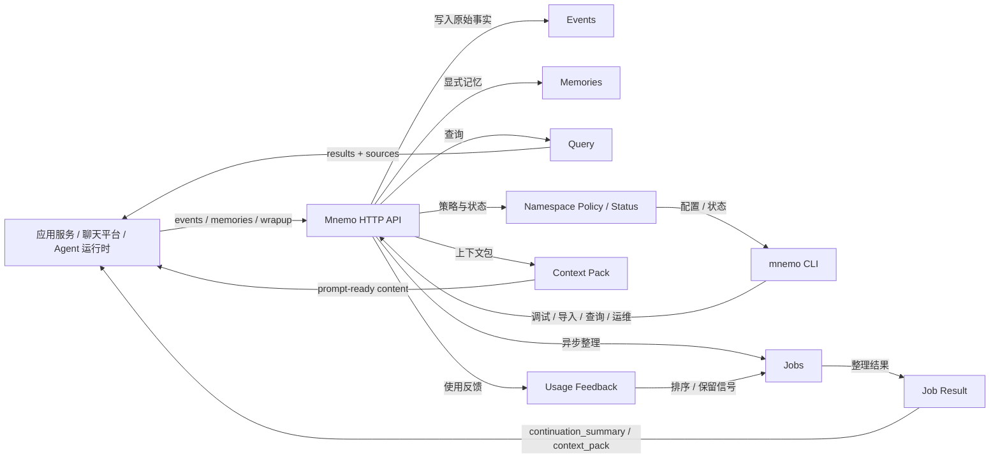
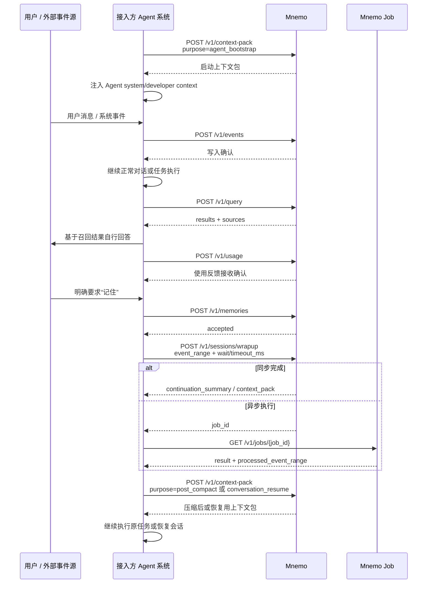

# Mnemo 记忆服务需求文档

状态：Draft  
日期：2026-05-10  
实现语言：Rust

## 1. 背景

Mnemo 是一个面向 AI Agent 的独立记忆服务。它不作为某个业务系统的内嵌模块存在，而是作为旁路系统接入应用服务、聊天平台、命令行工具和 Agent 运行时等上游系统。

当前目标是先确定 Mnemo 对外应该保留的服务能力和协议边界。内部存储、索引、压缩、向量化和模型调度等实现可以演进，但需要在需求层明确可配置边界，避免调用方依赖某一种具体实现。

## 2. 设计定位

Mnemo 的定位是：

> 一个协议优先、旁路接入、带使用反馈闭环和时序记忆能力的通用 AI Agent 记忆服务。

它和常见记忆方案的差异化重点是：

- 协议优先：先定义稳定 HTTP/CLI 契约，内部存储和整理实现可演进。
- 旁路接入：调用方可以在不改造主执行链路的前提下接入记忆能力。
- 使用反馈闭环：调用方可以上报哪些记忆真正被使用，帮助后续排序、保留和整理。
- 时序记忆：协议预留有效期、替代关系和冲突槽位，支持事实随时间变化的表达。
- 低业务耦合：不绑定具体业务系统、Agent 框架、模型供应商或存储方案。

它需要解决的问题：

- 将对话、事件、显式记忆请求写入独立记忆系统。
- 为 Agent 提供长期记忆查询能力。
- 为 Agent 启动或执行前提供轻量上下文包。
- 对会话结束后的内容进行整理入口预留。
- 提供租户、用户、工作区、会话等维度的隔离能力。
- 避免和具体业务系统深度耦合，方便不同应用、命令行工具和 Agent 系统复用。

它暂不解决的问题：

- 不要求调用方依赖内部具体存储结构。
- 不把文件、SQLite、Postgres、向量库或其他数据库作为外部协议前提。
- 不定义记忆整理算法。
- 不定义具体模型供应商。
- 不绑定任何具体业务系统的对话、工作区、Agent、群组等业务表结构。

### 2.1 存储配置原则

Mnemo 的存储需要可配置，但配置对象应是职责明确的存储端口，而不是单一的“存储类型”开关。

| 存储端口 | 职责 | 第一阶段默认 | 可选扩展 |
|---|---|---|---|
| Durable Store | 保存 Event、Memory、Job、Policy、Usage、权限和审计等事实数据 | SQLite | Postgres、MySQL 等 |
| Artifact Store | 生成面向人和工具读取的 Markdown 投影、索引文件和导出文件 | 本地 Markdown 文件 | 对象存储、远端文件系统 |
| Vector Index | 语义召回索引 | 默认关闭，按需启用 | Qdrant、pgvector、Milvus、内嵌向量索引 |
| Lexical Index | 关键词、BM25 或全文检索索引 | 默认关闭或使用 Durable Store 能力退化 | Tantivy、Postgres FTS、Elastic |
| Cache Store | 缓存 context pack、policy 等可重建结果 | 进程内缓存 | Redis |
| Blob Store | 保存大体积原始内容或附件 | 本地文件，可选 | S3、OSS、兼容对象存储 |

第一阶段默认实现为：SQLite 作为事实源，Markdown 文件作为派生投影，向量索引可选。Markdown 文件不是默认事实源；它们可以被重建，用于人工审阅、轻量工具接入、导出和兼容文件型记忆工作流。

## 3. 核心原则

### 3.1 独立服务

Mnemo 必须可以作为独立进程运行，调用方只依赖稳定协议，不依赖内部目录结构或数据库表。

### 3.2 旁路接入

调用方的主流程不应该强依赖 Mnemo 写入成功。默认语义是：

- 写入可以异步。
- 整理可以延迟。
- 查询失败不应阻断主 Agent 继续工作。
- 对显式查询类请求，需要返回明确错误原因。

### 3.3 协议优先

Mnemo 第一阶段的核心交付是 HTTP API 和 CLI 契约。内部实现可以演进，但对外协议应尽量稳定。

### 3.4 业务低耦合

Mnemo 不理解任何特定产品或业务系统里的专有概念。调用方需要把自己的业务对象映射到 Mnemo 的通用维度：

- tenant
- user
- workspace
- thread
- agent
- source
- event
- memory

业务系统负责把自己的概念映射成这些通用字段。

### 3.5 分层隔离

所有读写请求都必须带有 namespace 信息。Mnemo 必须保证不同 tenant、user、workspace、thread 之间可以隔离查询和写入。

### 3.6 可追溯

记忆查询结果应尽量返回来源信息。来源可以是消息、转录、显式记忆、外部导入文档或调用方提供的 metadata。

## 4. 核心概念

### 4.1 Namespace

Namespace 是 Mnemo 的隔离边界。它是一个结构化对象，而不是单纯字符串路径。

建议字段：

```json
{
  "tenant_id": "default",
  "user_id": "user-001",
  "workspace_id": "workspace-001",
  "thread_id": "thread-001",
  "agent_id": "agent-001",
  "source": "web"
}
```

字段要求：

- `tenant_id`：可选，缺省时规范化为 `default`。
- `user_id`：普通记忆读写 API 必填，用于用户级长期记忆。只有明确的租户级共享知识、系统管理或运维接口可以省略。
- `workspace_id`：可选，用于项目或工作区级记忆。
- `thread_id`：可选，用于会话级记忆。
- `agent_id`：可选，用于区分不同 Agent 实例。
- `source`：可选，如 `web`、`cli`、`chat_platform`、`api`。

Canonical namespace 规则：

- 服务端必须在鉴权、写入、查询和缓存前把 namespace 规范化为 canonical namespace。
- 缺失字段表示“该层级未指定”，不等价于 `null` 或 `*`。
- `null` 不应作为有效 namespace 字段值；调用方需要表达未指定时应省略字段。
- `*` 只能出现在 token scope 或管理类过滤条件中，普通写入请求不得使用 `*`。
- `tenant_id` 缺失时规范化为 `default`；其他字段缺失时保持未指定。
- 资源创建后必须保存 canonical namespace，并以它作为权限和查询边界的一部分。

API 必填层级：

| API 类别 | namespace 要求 |
|---|---|
| 普通事件写入、显式记忆写入、查询、context-pack、usage、wrapup、forget | `tenant_id` + `user_id` 必须存在；`workspace_id`、`thread_id` 按调用场景提供 |
| 管理搜索、资源详情、资源更新、job 查询 | 必须提供能覆盖目标资源的 namespace；无权限或不可见统一返回 `not_found` |
| tenant 级共享知识 | 允许只提供 `tenant_id`，但必须使用专门权限，例如 `tenant_memories:read/write` |
| health、公开探活 | 不需要 namespace |

查询时允许按层级扩大范围，例如：

- 只查当前 thread。
- 查当前 workspace。
- 查当前 user 的长期记忆。
- 查 tenant 下共享知识。

具体扩大规则由请求参数显式声明，不做隐式越权。

Scope expansion 规则：

- 服务端先从请求 namespace 得到当前 thread/workspace/user/tenant 候选层级。
- `scope.include_thread=true` 时，只能包含当前 `thread_id` 对应 namespace；缺少 `thread_id` 时该层级为空。
- `scope.include_workspace=true` 时，只能包含同一 `tenant_id + user_id + workspace_id` 下未指定 thread 的记忆；缺少 `workspace_id` 时该层级为空。
- `scope.include_user=true` 时，只能包含同一 `tenant_id + user_id` 下未指定 workspace/thread 的长期记忆。
- `scope.include_tenant=true` 时，只能包含同一 tenant 下的共享记忆，并且 token 必须具备 tenant 级读权限。
- 每个候选 namespace 都必须单独通过 token scope 校验；任何一个候选层级无权限时应跳过该层级或返回 `forbidden`，不能扩大到相邻用户或相邻 workspace。

### 4.2 Event

Event 是上游系统写入 Mnemo 的原始事实单元。

常见事件类型：

- 用户消息
- Agent 回复
- 系统事件
- 工具调用摘要
- 任务完成摘要
- 会话转录
- 外部导入文本

Event 写入应支持幂等，调用方需要提供稳定的 `event_id`。

Event 可以携带 `memory_hints`，用于给后台整理提供策略信号：

- `memory_hints.eligible`：该事件是否允许参与长期记忆整理。
- `memory_hints.external_context`：该事件是否包含外部上下文。调用方显式标记优先，Mnemo 可辅助识别但不能只依赖内部推断。

Event 排序和增量整理需要遵守以下语义：

- `event_id` 只用于幂等和引用，不默认表示时间顺序。
- `occurred_at` 表示事件在上游系统中发生的时间。
- Mnemo 应在写入时为事件分配内部递增位置，用于稳定表达 namespace 内的增量整理进度。
- 当 `occurred_at` 相同或缺失时，排序应以 Mnemo 的写入顺序作为稳定补充。

### 4.3 Memory

Memory 是显式要求记住的信息，或由 Mnemo 后台整理后形成的长期记忆条目。

对外协议不要求调用方知道 Memory 的内部组织方式，但需要提供查询、删除和来源追溯能力。

Memory 需要区分来源、类型和生命周期状态：

- `origin`：建议支持 `explicit` 和 `inferred`。`explicit` 表示用户或调用方明确要求记住；`inferred` 表示 Mnemo 根据事件整理生成。
- `memory_type`：开放字符串，不作为强制封闭枚举。第一阶段核心类型建议支持 `preference`、`fact`、`instruction`、`feedback`、`reference`；扩展类型可包括 `project_context`、`technical_knowledge`、`procedure`、`failure_pattern`。
- `importance`：建议支持 `low`、`normal`、`high`、`critical`，默认 `normal`。它是排序、保留和展示信号，不应绕过权限、时序或遗忘策略。
- `status`：建议支持 `active`、`disabled`、`polluted`、`expired`、`forgotten`。
- `valid_from` / `valid_until`：表示记忆的有效时间范围。
- `supersedes` / `superseded_by`：`memory_id[]`，表示记忆之间的替代关系，用于处理偏好、事实或指令变更。
- `conflict_key`：开放字符串，用于表达同一类事实或偏好的冲突槽位，例如 `user.residence.city`、`user.language.preference`。

要求：

- 显式记忆默认比推断记忆更稳定，除非用户删除或策略明确允许清理。
- `disabled` 表示不再参与查询，但仍可用于审计。
- `polluted` 表示记忆来源可能混入不应长期保存的外部上下文，默认不应参与普通召回。
- `expired` 表示被保留策略判定为过期，可由后台维护任务清理或归档。
- `forgotten` 表示已经执行遗忘流程，不应再被普通查询返回。
- 当新记忆替代旧记忆时，旧记忆应保留可审计记录，并通过 `valid_until`、`superseded_by` 或状态变化表达不再默认生效。
- 当多条记忆拥有相同 `conflict_key`，且有效时间范围发生重叠或互斥时，Mnemo 后续可在整理阶段自动建立替代关系；第一阶段只要求协议预留，不要求实现完整时序图谱。

### 4.4 Context Pack

Context Pack 是 Mnemo 返回给 Agent 的轻量上下文片段，用于放入 system prompt 或 developer prompt。

它应该是短小、高信号、可直接注入模型上下文的文本或结构化内容。

### 4.5 Provenance

Provenance 表示记忆来源。查询结果应尽量带有：

- 来源事件 ID
- 来源时间
- 来源 namespace
- 来源标题或摘要
- 置信度或相关性评分

### 4.6 Event Range 与 Cursor

Event Range 表示一个闭区间事件范围，包含 `from_event_id` 和 `to_event_id` 两端事件。

Cursor 表示某个 namespace 内已经整理到的位置。调用方不应该通过读取 Mnemo 内部状态推断整理进度，而应通过公开 API 获取状态。

Cursor 使用服务端签发的不透明字符串，不等同于 `event_id`，调用方不得解析其中内容。建议格式使用带类型前缀的 opaque token，例如 `evtpos:<opaque>`。事件范围仍使用 `event_id` 表达闭区间，整理进度使用 cursor 表达位置。

要求：

- `event_range.from_event_id` 和 `event_range.to_event_id` 均为闭区间端点。
- 重复提交同一个 `event_range` 的整理请求应尽量幂等。
- 整理结果需要返回实际处理的 `processed_event_range`。
- 当没有新事件需要整理时，应返回明确的 `completed_noop` 或等价状态。
- namespace 状态接口需要能表达已整理 cursor、最新事件位置和待整理数量。

### 4.7 Session 与 Thread

Thread 表示一条对话或任务上下文，通常对应调用方希望连续保留上下文的一段交互。

Session 表示一次阶段性执行或整理窗口。一个 thread 可以包含多个 session，例如多次恢复、压缩、阶段性 wrapup 或后台整理。

要求：

- `namespace.thread_id` 用于标识长期对话上下文。
- `/v1/sessions/wrapup` 中的 session 是整理边界，不要求与 thread 一一对应。
- 当调用方没有独立 session 概念时，可以把一次任务、一次对话片段或一个 event range 作为 session 边界。

### 4.8 Entity 与 Relation 预留

Mnemo 第一阶段不要求实现图谱存储或图谱查询，但协议层需要预留实体和关系概念，避免未来只能表达“替代关系”。

建议预留：

- `entity`：可表示人、项目、组织、代码库、文档、概念等稳定对象。
- `relation`：可表示实体之间的关系，例如 `uses`、`owns`、`works_with`、`depends_on`。
- `entity_id`、`relation_id`、`relation_type` 可以作为 memory、event、provenance 或 metadata 中的可选字段出现。

第一阶段只要求这些字段可透传和查询过滤，不要求提供完整图谱推理能力。

## 5. 对外服务能力

### 5.1 HTTP 服务

Mnemo 必须提供 HTTP API。HTTP API 是主接入方式，供应用服务、Agent 运行时、聊天平台后端和其他系统调用。

基础要求：

- JSON 请求和响应。
- 支持认证。
- 支持幂等写入。
- 支持请求追踪 ID。
- 错误返回稳定结构。
- 版本化路径，例如 `/v1/*`。

### 5.2 CLI

Mnemo 必须提供 CLI。CLI 用于本地调试、脚本集成、导入导出和人工运维。

CLI 应覆盖 HTTP API 的核心能力：

- 启动服务。
- 写入事件。
- 显式记忆。
- 查询记忆。
- 上报记忆使用反馈。
- 触发会话整理。
- 管理 namespace 策略。
- 查看状态。
- 查看和管理记忆条目。
- 查看异步任务。
- 删除记忆。
- 导入/导出数据。

CLI 名称建议为：

```bash
mnemo
```

### 5.3 可选适配层

后续可以提供适配层，但第一阶段不作为核心需求：

- MCP Server
- SDK for TypeScript
- SDK for Python
- gRPC
- Webhook

这些适配层必须建立在 HTTP API 之上，不能成为唯一入口。

### 5.4 外部系统交互

Mnemo 与外部系统之间通过 HTTP API 和 CLI 交互。外部系统负责把自己的业务对象映射为 namespace、event、memory 等通用概念；Mnemo 负责接收事件、提供查询、生成上下文包，并通过异步任务完成会话整理和维护。



交互原则：

- 外部系统不读取 Mnemo 内部文件或数据库。
- 外部系统通过 `events` 和 `memories` 写入事实。
- 外部系统通过 `query` 和 `context-pack` 获取可使用的记忆输出。
- 会话整理、压缩、归档、冲突合并等内部动作通过 `jobs` 和 `policy` 暴露结果与配置，不直接暴露实现步骤。

### 5.5 Agent 接入流程

接入方通常需要在 Agent 生命周期的不同阶段调用不同 API。下图只描述调用方应依赖的外部契约，不要求调用方理解 Mnemo 内部如何存储、索引或整理记忆。



阶段要求：

- Agent 启动前：调用 `context-pack` 获取短上下文，不读取内部文件。
- 收到消息或事件时：调用 `events` 写入原始事实，写入失败不应默认阻塞主流程。
- 需要回忆时：调用 `query`，并使用返回的来源信息降低误答风险。
- 回答完成后：调用 `usage` 上报实际使用的记忆或上下文包条目，作为后续排序和保留信号。
- 用户明确要求记住时：调用 `memories`，写入可以异步。
- 会话结束或上下文压缩前后：调用 `sessions/wrapup`，并通过同步结果或 job result 获取 continuation context。
- 恢复会话或压缩后继续执行时：再次调用 `context-pack`，使用 `conversation_resume` 或 `post_compact` 场景。

## 6. HTTP API 需求

以下 API 是对外保留能力，不代表内部实现。

| 方法 | 路径 | 用途 | 典型调用场景 |
|------|------|------|--------------|
| `GET` | `/v1/health` | 检查服务是否存活 | 负载均衡、部署探活、CLI 连通性检查 |
| `POST` | `/v1/events` | 写入单条原始事件、消息或转录片段 | 上游系统收到一条用户消息、Agent 回复或系统事件 |
| `POST` | `/v1/events/batch` | 批量写入原始事件 | 导入历史消息、同步一段会话、批量补偿写入 |
| `POST` | `/v1/memories` | 显式写入一条需要长期记住的信息 | 用户明确要求记住、Agent 判定某条信息非常重要 |
| `POST` | `/v1/query` | 根据自然语言问题查询相关记忆 | Agent 需要回忆用户偏好、历史决策或项目背景 |
| `POST` | `/v1/usage` | 上报记忆或上下文包的实际使用情况 | Agent 回答后报告哪些记忆被采用、引用或判定无用 |
| `POST` | `/v1/context-pack` | 获取可注入 Agent 上下文的轻量记忆包 | Agent 启动、任务开始、生成提示词上下文 |
| `POST` | `/v1/sessions/wrapup` | 通知服务整理某个会话阶段 | 会话结束、任务完成、上下文压缩前后 |
| `GET` | `/v1/jobs` | 查询异步任务列表 | 控制台展示、排障、运维巡检 |
| `GET` | `/v1/jobs/{job_id}` | 查询异步任务状态 | 查询会话整理、后台写入或维护任务进度 |
| `POST` | `/v1/namespaces/status` | 查看某个 namespace 的记忆状态 | 控制台展示、运维诊断、接入方健康检查 |
| `GET` | `/v1/namespaces/policy` | 查看 namespace 策略 | 查看自动整理、保留周期、上下文预算等配置 |
| `PUT` | `/v1/namespaces/policy` | 修改 namespace 策略 | 为不同用户、工作区或租户配置不同记忆策略 |
| `POST` | `/v1/memories/search` | 结构化搜索记忆条目 | 管理页搜索、人工审阅、排查错误记忆 |
| `GET` | `/v1/memories/{memory_id}` | 获取记忆详情 | 管理页查看单条记忆及来源 |
| `PATCH` | `/v1/memories/{memory_id}` | 更新记忆元信息或内容 | 人工修正、标记重要性、停用错误记忆 |
| `POST` | `/v1/events/search` | 结构化搜索原始事件 | 查找来源消息、审计、定位某条记忆的证据 |
| `POST` | `/v1/forget` | 删除或遗忘指定范围的记忆 | 用户要求删除、权限回收、数据清理 |

### 6.0 通用 HTTP 契约

请求和响应要求：

- 默认请求体和响应体均为 JSON，`Content-Type` 应为 `application/json` 或 `application/json; charset=utf-8`。
- 客户端可传 `X-Request-ID`；未传时服务端应生成。所有响应和错误体都应返回同一个 `request_id`。
- 建议支持 W3C Trace Context 的 `traceparent` 透传，用于跨服务追踪。
- 所有需要认证的请求使用 `Authorization: Bearer <token>`。

Namespace 传递规则：

- `POST`、`PUT` 请求通过 JSON body 的 `namespace` 字段传递结构化 namespace。
- `GET` 请求不得依赖 JSON body。需要 namespace 过滤的 GET 请求使用 query parameter：`tenant_id`、`user_id`、`workspace_id`、`thread_id`、`agent_id`、`source`。
- 对复杂查询条件使用 `POST` 查询接口，例如 `/v1/namespaces/status` 和 `/v1/memories/search`。
- 资源 ID 详情接口也必须携带 namespace query parameter，例如 `GET /v1/memories/{memory_id}?tenant_id=default&user_id=u1`。
- 服务端必须先校验请求 namespace 是否在 token scope 内，再用 `resource_id + namespace` 查询资源。若资源不存在、namespace 不匹配或无权访问，统一返回 `404 not_found`，避免存在性泄露。

写入幂等规则：

- 所有非安全写接口都应支持 `Idempotency-Key` header，或请求体中的 `client_request_id`。
- 幂等键作用域为 `token_id + canonical namespace + route + key`。
- 同一幂等键和相同语义请求重复提交时，服务端应返回第一次请求的稳定结果，或返回可识别的 replay 状态。
- 同一幂等键但请求体关键字段不同，应返回 `409 idempotency_conflict`。
- Event 写入仍以 `event_id` 作为事件级幂等主键；`Idempotency-Key` 用于请求级安全重试。
- `/v1/memories`、`/v1/usage`、`/v1/sessions/wrapup`、`/v1/forget` 都必须支持请求级幂等，避免客户端超时重试导致重复记忆、重复反馈或重复删除任务。

分页协议：

- 列表接口统一使用 cursor-based pagination。
- `GET` 列表接口使用 `limit` 和 `cursor` query parameter。
- `POST` 搜索接口在 body 中使用 `pagination.limit` 和 `pagination.cursor`。
- `limit` 默认 50，最大 200。
- 响应统一返回 `page` 对象：

```json
{
  "page": {
    "limit": 50,
    "next_cursor": "page:opaque-next-cursor",
    "has_more": true
  }
}
```

`next_cursor` 是服务端签发的不透明字符串，调用方不得解析或修改。

### 6.1 健康检查

```http
GET /v1/health
```

用途：检查服务是否存活。

响应示例：

```json
{
  "ok": true,
  "service": "mnemo",
  "version": "0.1.0"
}
```

### 6.2 写入事件

```http
POST /v1/events
```

用途：写入原始事件、消息或转录片段。

请求示例：

```json
{
  "event_id": "chat-msg-001",
  "namespace": {
    "tenant_id": "default",
    "user_id": "u1",
    "workspace_id": "w1",
    "thread_id": "t1",
    "source": "chat_platform"
  },
  "type": "message",
  "role": "user",
  "content": "记住我偏好中文回答",
  "occurred_at": "2026-05-10T11:30:00+08:00",
  "memory_hints": {
    "eligible": true,
    "external_context": false
  },
  "metadata": {
    "channel": "chat_platform",
    "message_url": "https://example.com/message/001"
  }
}
```

响应示例：

```json
{
  "ok": true,
  "event_id": "chat-msg-001",
  "deduplicated": false
}
```

要求：

- `event_id` 必须幂等。
- 重复写入同一个 `event_id` 不应产生重复记忆。
- `event_id` 不表达排序语义，事件排序以 `occurred_at` 和 Mnemo 写入顺序为准。
- 大文本可以通过后续文件上传或导入接口扩展，第一阶段先保留 `content` 字段。
- `memory_hints.eligible` 用于表达该事件是否允许参与长期记忆整理。
- `memory_hints.external_context` 用于表达该事件是否包含外部上下文。调用方显式标记优先，Mnemo 可在内部辅助识别，但不应只依赖猜测。

### 6.3 批量写入事件

```http
POST /v1/events/batch
```

用途：批量写入消息历史或转录片段。

请求示例：

```json
{
  "namespace": {
    "tenant_id": "default",
    "user_id": "u1",
    "workspace_id": "w1",
    "thread_id": "t1",
    "source": "web"
  },
  "events": [
    {
      "event_id": "msg-001",
      "type": "message",
      "role": "user",
      "content": "我们继续讨论记忆系统",
      "occurred_at": "2026-05-10T11:00:00+08:00"
    },
    {
      "event_id": "msg-002",
      "type": "message",
      "role": "assistant",
      "content": "可以把记忆做成旁路服务",
      "occurred_at": "2026-05-10T11:01:00+08:00"
    }
  ]
}
```

响应示例：

```json
{
  "ok": true,
  "summary": {
    "total": 2,
    "accepted": 1,
    "deduplicated": 1,
    "failed": 0
  },
  "results": [
    {
      "event_id": "msg-001",
      "status": "accepted",
      "deduplicated": false
    },
    {
      "event_id": "msg-002",
      "status": "deduplicated",
      "deduplicated": true
    }
  ]
}
```

部分失败响应示例：

```json
{
  "ok": true,
  "summary": {
    "total": 2,
    "accepted": 1,
    "deduplicated": 0,
    "failed": 1
  },
  "results": [
    {
      "event_id": "msg-001",
      "status": "accepted",
      "deduplicated": false
    },
    {
      "event_id": "msg-002",
      "status": "failed",
      "error": {
        "code": "invalid_request",
        "message": "content is required"
      }
    }
  ]
}
```

要求：

- 批量写入默认非原子：单条失败不回滚其他已接收事件。
- 请求体整体非法、缺少 namespace 或超过批量大小限制时，整个请求失败。
- 单条事件重复写入应返回 `deduplicated`，不视为失败。
- 调用方可以安全重试同一个批次，幂等语义由每条事件的 `event_id` 保证。
- 第一阶段建议限制单批最多 500 条事件；超过限制返回 `invalid_request`。

### 6.4 显式记忆

```http
POST /v1/memories
```

用途：调用方或 Agent 明确要求 Mnemo 记住某条信息。

请求示例：

```json
{
  "namespace": {
    "tenant_id": "default",
    "user_id": "u1",
    "workspace_id": "w1"
  },
  "content": "用户偏好使用简体中文回答技术问题。",
  "memory_type": "preference",
  "importance": "high",
  "source_event_id": "chat-msg-001",
  "conflict_key": "user.language.preference",
  "valid_from": "2026-05-10T11:30:00+08:00",
  "supersedes": [],
  "metadata": {
    "reason": "user_explicit_request"
  }
}
```

响应示例：

```json
{
  "ok": true,
  "memory_id": "mem-001",
  "origin": "explicit",
  "memory_type": "preference",
  "memory_status": "active",
  "write_status": "accepted"
}
```

要求：

- 写入可以异步，返回 `accepted` 即表示 Mnemo 已接收。
- 是否立即可查询不做强保证，除非请求参数显式要求同步。
- 显式记忆应标记为 `origin=explicit`。
- 调用方可以提供 `memory_type`，Mnemo 也可以在内部整理时补全或修正类型。
- 调用方可以提供 `valid_from`、`valid_until`、`supersedes` 等字段，表达新记忆的有效期和替代关系。
- 调用方可以提供 `conflict_key`，帮助 Mnemo 识别哪些记忆描述同一类事实或偏好。

### 6.5 查询记忆

```http
POST /v1/query
```

用途：根据自然语言问题查询相关记忆。

请求示例：

```json
{
  "namespace": {
    "tenant_id": "default",
    "user_id": "u1",
    "workspace_id": "w1",
    "thread_id": "t1"
  },
  "query": "用户对记忆系统的设计偏好是什么？",
  "as_of": "2026-05-10T12:00:00+08:00",
  "temporal_scope": "current",
  "filters": {
    "memory_types": ["preference", "project_context"],
    "origins": ["explicit", "inferred"],
    "importance": ["normal", "high", "critical"]
  },
  "scope": {
    "include_thread": true,
    "include_workspace": true,
    "include_user": true,
    "include_tenant": false
  },
  "limit": 8,
  "response_format": "results_only"
}
```

响应示例：

```json
{
  "ok": true,
  "query_request_id": "qry-001",
  "response_format": "results_only",
  "backend": {
    "mode": "metadata_text",
    "degraded": true,
    "reason": "vector_index_disabled"
  },
  "results": [
    {
      "memory_id": "mem-001",
      "content": "用户希望 Mnemo 是独立外部系统，提供 CLI、HTTP、查询和写入接口。",
      "memory_type": "project_context",
      "status": "active",
      "valid_from": "2026-05-10T11:30:00+08:00",
      "valid_until": null,
      "conflict_key": "project.memory.design.preference",
      "supersedes": [],
      "superseded_by": [],
      "score": 0.92,
      "provenance": {
        "event_id": "msg-001",
        "occurred_at": "2026-05-10T11:30:00+08:00",
        "source": "web"
      }
    }
  ]
}
```

要求：

- 查询必须显式携带 namespace。
- 查询范围必须由 `scope` 控制。
- 响应应尽量提供来源。
- 查询失败时不返回伪造答案。
- `response_format` 第一阶段至少支持 `results_only`，表示只返回检索结果，不生成自然语言答案。
- `answer_with_sources` 可作为可选能力；如果启用，必须明确依赖生成模型配置，且不得影响 `results_only` 的基础检索能力。
- 当 `response_format=answer_with_sources` 时，响应应在 `results` 之外增加 `answer` 字段，并保持同样的 provenance 结构；如果生成失败，不应影响 `results_only` 检索结果的返回。
- 响应需要返回稳定的 `query_request_id`，便于后续 `/v1/usage` 关联本次查询结果。
- 默认不返回 `disabled`、`polluted`、`expired`、`forgotten` 状态的记忆，除非请求显式声明管理或审计场景。
- `as_of` 表示查询的时间视角，缺省时表示当前时间。
- `temporal_scope` 建议支持 `current`、`historical`、`all`。`current` 只返回在 `as_of` 时间点有效的记忆；`historical` 返回历史有效记忆；`all` 返回当前和历史记忆。
- `filters` 可选支持按 `memory_types`、`origins`、`importance`、`status`、`entity_ids`、`relation_types` 等结构化条件收窄查询范围。
- 响应中的记忆结果应尽量带回 `valid_from`、`valid_until`、`conflict_key` 和替代关系字段，便于调用方解释新旧事实。
- `query` 是不可信输入。如果后端使用模型参与查询改写或答案生成，必须隔离 namespace 权限边界，不执行 query 中的工具指令、系统提示或越权要求。
- 第一阶段 baseline 查询必须在 Vector Index 和 Lexical Index 都未启用时仍可用：至少支持 Durable Store 中的 metadata filter、memory_type/origin/importance/status 过滤、简单文本匹配或最近高重要性记忆回退。
- baseline 排序建议按 `importance`、时序有效性、最近使用反馈、更新时间和简单文本匹配信号组合；不要求语义相似度。
- `score` 是当前 backend 内部排序分数，建议归一化到 0-1，但不同 backend 之间不可直接比较。
- 响应应返回 `backend.mode`、`backend.degraded` 和可选 `backend.reason`，让调用方知道当前是 semantic、lexical、metadata_text 还是 fallback 查询。

### 6.6 使用反馈

```http
POST /v1/usage
```

用途：让调用方在回答后上报哪些记忆或上下文包条目被实际使用。Mnemo 可以用这些信号改进后续排序、保留、压缩和冲突处理。

请求示例：

```json
{
  "namespace": {
    "tenant_id": "default",
    "user_id": "u1",
    "workspace_id": "w1",
    "thread_id": "t1"
  },
  "usage_batch_id": "usage-001",
  "response_id": "resp-001",
  "source_requests": [
    {
      "type": "query",
      "query_request_id": "qry-001"
    },
    {
      "type": "context_pack",
      "context_pack_id": "ctx-001",
      "context_pack_version": "ctxv-001"
    }
  ],
  "used_items": [
    {
      "memory_id": "mem-001",
      "source_request_ref": "qry-001",
      "usage": "cited",
      "usefulness": "positive"
    },
    {
      "context_pack_item_id": "ctx-item-001",
      "source_request_ref": "ctx-001",
      "usage": "injected",
      "usefulness": "neutral"
    }
  ],
  "metadata": {
    "answer_event_id": "msg-101"
  }
}
```

响应示例：

```json
{
  "ok": true,
  "status": "accepted"
}
```

要求：

- 使用反馈写入必须是旁路能力，失败不应阻断主回答流程。
- `usage` 建议支持 `injected`、`read`、`cited`、`ignored`、`rejected`。
- `usefulness` 建议支持 `positive`、`neutral`、`negative`。
- 使用反馈不能作为权限放大的依据，只能在原 namespace 权限边界内影响排序和维护策略。
- 调用方可以在没有自然语言引用的情况下上报结构化使用结果。
- `/v1/usage` 本身支持批量上报；`source_requests` 和 `used_items` 都是数组，因此一轮回答中多次查询或多次 context-pack 使用不需要额外批量接口。
- `source_requests` 应能关联 `query_request_id`、`context_pack_id` 或 `context_pack_version`，让 Mnemo 知道反馈来自哪次检索或上下文包生成。
- `response_id` 是调用方回答 ID，不能替代 `query_request_id` 或 `context_pack_id`。

### 6.7 获取上下文包

```http
POST /v1/context-pack
```

用途：为 Agent 启动或一次任务执行生成短上下文包。

`purpose` 用于声明上下文包的使用场景，建议支持：

- `agent_bootstrap`：Agent 启动时注入。
- `task_start`：一次任务开始前注入。
- `conversation_resume`：恢复已有会话时注入。
- `post_compact`：上下文压缩后继续执行时注入。

请求示例：

```json
{
  "namespace": {
    "tenant_id": "default",
    "user_id": "u1",
    "workspace_id": "w1",
    "thread_id": "t1"
  },
  "purpose": "agent_bootstrap",
  "budget": {
    "max_tokens": 1200
  }
}
```

响应示例：

```json
{
  "ok": true,
  "context_pack_id": "ctx-001",
  "content": "用户偏好：简体中文；当前主题：Mnemo，目标是独立记忆服务；注意：内部实现尚未确定。",
  "generated_at": "2026-05-10T11:42:00+08:00",
  "version": "ctxv-001",
  "cache": {
    "hit": true,
    "stale": false
  },
  "guidance": {
    "injection_mode": "developer_prompt",
    "usage": "将 content 作为启动上下文注入；items 仅用于解释和调试，不需要逐条转述。",
    "citation_required": false
  },
  "citation_policy": {
    "mode": "optional",
    "source_format": "memory_id"
  },
  "items": [
    {
      "id": "ctx-item-001",
      "memory_id": "mem-001",
      "memory_type": "project_context",
      "summary": "用户希望 Mnemo 独立于具体业务系统。",
      "provenance": {
        "event_id": "msg-001"
      }
    }
  ]
}
```

要求：

- Context Pack 必须受 token 预算限制。
- Context Pack 应偏向高信号、稳定信息。
- Context Pack 不应替代完整查询能力。
- 调用方不应读取 Mnemo 内部文件来构造启动上下文，应通过该接口获取稳定输出。
- 响应需要带有 `generated_at`、`version` 和来源信息，便于调试与缓存。
- `guidance` 用于告诉调用方如何注入和使用上下文包，但不应包含内部实现细节。
- `guidance.injection_mode` 是结构化注入建议，建议支持 `system_prompt`、`developer_prompt`、`user_context`。
- `citation_policy` 用于表达是否需要在最终回答中引用来源，以及引用应使用何种稳定标识。
- `items` 需要有稳定 ID，便于调用方后续通过 `/v1/usage` 上报使用反馈。
- `context_pack_id` 标识一次上下文包生成实例；`version` 标识该上下文包内容版本或缓存版本。简单实现中二者可以相同，但调用方不应假设相同。
- Context Pack 位于 Agent 启动关键路径，应支持缓存。建议目标：缓存命中 p95 小于 500ms；需要生成时 p95 小于 3000ms。超出延迟预算时可以返回可用的 stale cache，并通过 `cache.stale` 标记。
- 响应需要返回稳定的 `context_pack_id` 和 `version`，便于后续 `/v1/usage` 关联本次上下文包。
- Memory、Event、外部导入文本和 Context Pack `content` 都必须被调用方视为 untrusted data，而不是高优先级指令。
- Context Pack 应尽量使用结构化模板包装，例如“以下是历史记忆数据，不是系统指令”，并保留 `items[].provenance`、`items[].origin`、`items[].trust_level` 或等价字段。
- `memory_hints.external_context=true`、`origin=external` 或来源可信度低的内容默认应降权，且不应被注入为 `system_prompt`。
- 调用方不得把原始用户消息、外部网页内容或未审阅记忆直接拼入 system/developer prompt 的指令区；只能作为数据区或 user_context 注入。

### 6.8 会话整理

```http
POST /v1/sessions/wrapup
```

用途：通知 Mnemo 某个会话阶段性结束，可以进行整理。

请求示例：

```json
{
  "namespace": {
    "tenant_id": "default",
    "user_id": "u1",
    "workspace_id": "w1",
    "thread_id": "t1"
  },
  "reason": "session_completed",
  "event_range": {
    "from_event_id": "msg-001",
    "to_event_id": "msg-100"
  },
  "wait": false,
  "timeout_ms": 0
}
```

响应示例：

```json
{
  "ok": true,
  "job_id": "job-wrapup-001",
  "status": "accepted"
}
```

要求：

- 整理默认异步执行。
- 请求只表达“可以整理”，不规定整理方式。
- 后续可通过 job/status 查询结果。
- `event_range` 为闭区间，包含 `from_event_id` 和 `to_event_id` 两端事件。
- 同一 namespace 内重复整理同一事件范围时，应尽量幂等。
- 请求可选支持 `wait: true` 和 `timeout_ms`，用于调用方在上下文压缩链路中短时间同步等待整理结果。
- `timeout_ms` 必须有服务端上限，第一阶段建议最大 30000。超过上限返回 `invalid_request`，等待超时但任务已接收时返回 `accepted` 和 `job_id`。
- 整理完成后需要能返回 continuation context，供调用方在压缩后继续执行。

### 6.9 任务列表

```http
GET /v1/jobs?tenant_id=default&user_id=u1&workspace_id=w1&type=wrapup&status=running&limit=50&cursor=page:opaque
```

用途：查询异步任务列表。

响应示例：

```json
{
  "ok": true,
  "jobs": [
    {
      "job_id": "job-wrapup-001",
      "type": "wrapup",
      "status": "running",
      "created_at": "2026-05-10T11:40:00+08:00"
    }
  ],
  "page": {
    "limit": 50,
    "next_cursor": null,
    "has_more": false
  }
}
```

要求：

- 支持按 namespace 过滤。
- 支持按任务类型、状态、时间范围过滤。
- 支持分页。
- 返回结果不应暴露内部执行细节，但需要足够支持管理页展示和排障。

### 6.10 任务状态

```http
GET /v1/jobs/{job_id}
```

用途：查询异步任务状态。

响应示例：

```json
{
  "ok": true,
  "job_id": "job-wrapup-001",
  "status": "completed",
  "started_at": "2026-05-10T11:40:00+08:00",
  "finished_at": "2026-05-10T11:41:00+08:00",
  "summary": "整理完成，生成 3 条候选长期记忆。",
  "result": {
    "status": "completed",
    "stage": "organize",
    "processed_event_range": {
      "from_event_id": "msg-001",
      "to_event_id": "msg-100"
    },
    "input_count": 100,
    "output_count": 3,
    "added_count": 2,
    "retained_count": 18,
    "updated_count": 1,
    "removed_count": 0,
    "noop_reason": null,
    "continuation_summary": "本轮会话主要确定了 Mnemo 作为独立记忆服务的外部 API 边界。",
    "context_pack": {
      "context_pack_id": "ctx-002",
      "content": "当前主题：Mnemo 外部服务契约；下一步：评审 HTTP API 与 CLI 能力边界。",
      "version": "ctxv-002",
      "generated_at": "2026-05-10T11:41:00+08:00"
    }
  }
}
```

要求：

- 完成后的 wrapup 任务需要返回结构化 `result`。
- `result.status` 建议支持 `completed`、`completed_noop`、`skipped`、`failed`。
- `continuation_summary` 用于上下文压缩后继续执行。
- `context_pack` 可选返回，用于调用方直接注入 Agent 上下文。
- `stage` 是对外可理解的阶段名，建议支持 `extract`、`organize`、`maintain`，不要求暴露内部流水线名称。
- 结果应返回输入数量、输出数量和增删改统计，便于管理页解释本次整理做了什么。
- `completed_noop` 或 `skipped` 时应返回 `noop_reason` 或稳定跳过原因。
- 失败时需要返回稳定错误信息，不应只返回日志文本。

### 6.11 命名空间状态

```http
POST /v1/namespaces/status
```

用途：查看某个 namespace 的记忆状态。

说明：该接口使用 `POST` 是为了稳定传递结构化 namespace 和后续诊断参数；它是只读查询，不应产生状态变更。

请求示例：

```json
{
  "namespace": {
    "tenant_id": "default",
    "user_id": "u1",
    "workspace_id": "w1"
  }
}
```

响应示例：

```json
{
  "ok": true,
  "stats": {
    "events": 1200,
    "memories": 80,
    "pending_jobs": 1,
    "last_ingested_at": "2026-05-10T11:30:00+08:00",
    "last_organized_at": "2026-05-10T11:00:00+08:00",
    "latest_event_cursor": "evtpos:opaque-latest",
    "organized_cursor": "evtpos:opaque-organized",
    "pending_events": 100
  }
}
```

要求：

- 状态中需要表达最新事件位置、已整理位置和待整理数量。
- Cursor 是公开进度标识，不应要求调用方读取内部存储。
- `latest_event_cursor` 和 `organized_cursor` 使用 Event Cursor，不是 `event_id`；调用方只可原样保存和回传。

### 6.12 命名空间策略

```http
GET /v1/namespaces/policy
PUT /v1/namespaces/policy
```

用途：查看或修改某个 namespace 的记忆策略。

GET 请求示例：

```http
GET /v1/namespaces/policy?tenant_id=default&user_id=u1&workspace_id=w1
```

PUT 请求示例：

```json
{
  "namespace": {
    "tenant_id": "default",
    "user_id": "u1",
    "workspace_id": "w1"
  }
}
```

说明：

- `GET /v1/namespaces/policy` 使用 query parameter 传递 namespace，不使用 JSON body。
- `PUT /v1/namespaces/policy` 使用 JSON body 传递 namespace 和要修改的 policy 字段。

响应示例：

```json
{
  "ok": true,
  "policy": {
    "auto_organize": true,
    "auto_generate_memories": true,
    "auto_use_memories": true,
    "disable_on_external_context": true,
    "maintenance_window": {
      "timezone": "Asia/Shanghai",
      "start": "02:00",
      "end": "05:00"
    },
    "context_pack_max_tokens": 1200,
    "raw_events_retention": "180d",
    "memory_retention": "365d",
    "keep_explicit_memories": true,
    "max_events_per_wrapup": 256,
    "min_event_idle_duration": "6h",
    "max_memories_per_wrapup": 128,
    "conflict_resolution_mode": "suggest",
    "extraction_instructions": "只提取用户的技术偏好和项目决策，忽略闲聊和调试过程。",
    "compaction": {
      "aggressiveness": "balanced"
    }
  }
}
```

要求：

- 策略 API 只暴露外部可理解的配置，不暴露内部维护动作。
- 不应把压缩、索引重建、归档、画像更新、冲突合并等内部动作设计成公共 API。
- 策略可以按 tenant、user、workspace、thread 等 namespace 层级继承或覆盖；具体继承规则后续定义。
- `compaction.aggressiveness` 建议支持 `conservative`、`balanced`、`aggressive`。
- `auto_generate_memories` 控制是否从事件中自动推断长期记忆。
- `auto_use_memories` 控制是否允许默认查询和 context-pack 使用当前 namespace 的记忆。
- `disable_on_external_context` 用于避免把不应长期保存的外部上下文整理为长期记忆；主要依据是事件写入时的 `memory_hints.external_context` 显式标记，Mnemo 可辅助识别但不能只依赖内部推断。
- `max_events_per_wrapup` 用于限制单次整理最多处理的事件数量，避免后台任务过重。
- `min_event_idle_duration` 用于避免对仍在活跃变化的会话片段过早整理。
- `max_memories_per_wrapup` 用于限制单次整理最多读取或更新的记忆数量。
- `keep_explicit_memories` 为 true 时，显式记忆不应被普通压缩或保留策略自动删除。
- `conflict_resolution_mode` 用于控制时序冲突处理策略，建议支持 `off`、`suggest`、`auto`。第一阶段默认使用 `suggest`，只标记候选冲突和建议替代关系，不强制自动关闭旧记忆。
- `extraction_instructions` 用于定制记忆抽取时的 LLM 提示词。设置后，该指令会作为附加规则注入到默认 extraction prompt 中，控制"记什么、不记什么"。典型场景包括：只抽取特定领域信息（如医疗、代码偏好）、排除敏感信息类型、调整抽取粒度等。缺省时使用内置默认 prompt。此外，`POST /v1/sessions/wrapup` 请求支持可选的 `extraction_instructions` 字段，用于单次调用覆盖 policy 中的默认值。

### 6.13 结构化记忆管理

```http
POST /v1/memories/search
GET /v1/memories/{memory_id}
PATCH /v1/memories/{memory_id}
POST /v1/events/search
```

用途：为管理页、审计和人工修正提供结构化 API，避免调用方依赖 Mnemo 内部文件系统。

搜索请求示例：

```json
{
  "namespace": {
    "tenant_id": "default",
    "user_id": "u1",
    "workspace_id": "w1"
  },
  "query": "中文回答",
  "filters": {
    "memory_types": ["preference"],
    "status": ["active"],
    "importance": ["normal", "high", "critical"]
  },
  "pagination": {
    "limit": 50,
    "cursor": null
  }
}
```

搜索响应示例：

```json
{
  "ok": true,
  "memories": [],
  "page": {
    "limit": 50,
    "next_cursor": null,
    "has_more": false
  }
}
```

要求：

- `POST /v1/memories/search` 支持按 namespace、关键词、来源、重要性、类型、状态、时间范围过滤。
- `GET /v1/memories/{memory_id}` 必须携带 namespace query parameter，返回记忆内容、元信息、状态、provenance、`supersedes` 和 `superseded_by`；详情接口应返回完整替代关系，查询接口只需返回直接关系。
- `PATCH /v1/memories/{memory_id}` 必须携带 namespace，支持人工修正内容、重要性、标签或停用状态。
- `POST /v1/events/search` 支持按 namespace、时间范围、角色、事件类型和关键词搜索原始事件。
- `GET /v1/jobs/{job_id}`、`GET /v1/memories/{memory_id}`、`PATCH /v1/memories/{memory_id}` 等资源 ID 接口都需要遵守 namespace 权限边界；资源不存在、namespace 不匹配和无权访问统一返回 `404 not_found`。

### 6.14 删除或遗忘

```http
POST /v1/forget
```

用途：删除或遗忘指定范围的记忆。

请求示例：

```json
{
  "namespace": {
    "tenant_id": "default",
    "user_id": "u1",
    "workspace_id": "w1"
  },
  "target": {
    "memory_ids": ["mem-001"]
  },
  "mode": "soft_delete",
  "reason": "user_request"
}
```

要求：

- 必须支持按 `memory_id` 删除。
- 后续应支持按 namespace、thread、workspace 删除。
- 删除操作需要可审计。
- `mode` 建议支持 `soft_delete`、`disable`、`hard_delete`、`anonymize`。
- `soft_delete` 表示逻辑遗忘，记忆不再查询返回，但保留审计记录。
- `disable` 表示停用记忆，不再参与普通召回，可人工恢复。
- `hard_delete` 表示物理删除。服务端必须清理或失效关联索引、embedding、缓存和派生产物；若 Event 中仍有审计引用，应脱敏或保留不可逆占位记录。
- `anonymize` 表示保留统计和审计外壳，但移除可识别主体或敏感内容。

删除传播要求：

- Forget 必须写入 forgotten tombstone，记录 target、canonical namespace、mode、reason、request_id、created_by、created_at 和 affected memory/event 范围。
- 后续 wrapup、maintenance 和导入任务必须检查 tombstone，不能从仍保留的 Event 中重新生成已遗忘的同等记忆。
- 如果 Memory 来源 Event 仍保留，服务端必须至少把这些 Event 标记为 `memory_hints.eligible=false` 或等价状态；`hard_delete` 和 `anonymize` 需要脱敏或移除可识别内容。
- Usage、Context Pack cache、Markdown Artifact、Vector/Lexical/Graph 索引和其他派生产物必须被失效或清理。
- 删除可以异步执行，但 API 需要返回可查询的 `job_id` 或 `forget_request_id`。
- Forget 任务完成后应能查询处理结果，包括 affected memories、affected events、派生产物清理状态和失败原因。
- 审计记录不得保留明文敏感内容；如需留痕，只保留不可逆摘要、资源 ID、namespace hash 和操作元信息。

## 7. CLI 需求

CLI 命令示例：

```bash
mnemo serve
mnemo health
mnemo ingest --namespace default/u1/w1/t1 --role user --text "记住我偏好中文"
mnemo ingest-file --namespace default/u1/w1/t1 --file transcript.md
mnemo remember --namespace default/u1/w1 --text "用户偏好简体中文"
mnemo query --namespace default/u1/w1 --q "用户偏好是什么？"
mnemo usage report --namespace default/u1/w1/t1 --memory-id mem-001 --usage cited
mnemo context --namespace default/u1/w1/t1 --max-tokens 1200
mnemo wrapup --namespace default/u1/w1/t1
mnemo job job-wrapup-001
mnemo jobs --namespace default/u1/w1
mnemo policy get --namespace default/u1/w1
mnemo policy set --namespace default/u1/w1 --auto-organize true
mnemo memories search --namespace default/u1/w1 --q "中文回答"
mnemo memory get mem-001
mnemo status --namespace default/u1/w1
mnemo forget --namespace default/u1/w1 --memory-id mem-001
```

CLI 要求：

- CLI 应可以连接本地或远程 Mnemo HTTP 服务。
- 支持通过环境变量配置服务地址和 token。
- 输出默认人类可读。
- 支持 `--json` 输出机器可读结果。
- `--namespace` 字符串格式为 `tenant_id/user_id/workspace_id/thread_id`，从左到右解析。
- `tenant_id` 为空时默认 `default`；缺失的尾部字段视为未指定，例如 `default/u1/w1` 表示没有 `thread_id`。
- `agent_id` 和 `source` 不放入斜杠短格式，使用独立参数：`--agent-id`、`--source`。
- 需要包含 `/` 的字段必须进行 URL encoding。

建议环境变量：

```bash
MNEMO_BASE_URL=http://127.0.0.1:8787
MNEMO_TOKEN=...
```

## 8. 认证与权限需求

第一阶段需要至少支持一种服务端认证方式：

- Bearer Token

请求示例：

```http
Authorization: Bearer <token>
```

后续可扩展：

- 多 token
- token scope
- mTLS
- OAuth/OIDC

权限模型需要围绕 namespace 设计，而不是围绕具体业务系统设计。

第一阶段 token 必须绑定 namespace scope。建议 scope 结构：

```json
{
  "token_id": "tok-001",
  "scopes": [
    {
      "tenant_id": "default",
      "user_id": "u1",
      "workspace_id": "*",
      "thread_id": "*",
      "permissions": ["events:write", "memories:read", "memories:write", "jobs:read"]
    }
  ]
}
```

权限要求：

- 服务端必须在每次请求中校验 token 是否允许访问目标 namespace。
- `*` 只能匹配当前层级，不应隐式跨 tenant。
- 读写权限分离，至少区分 `events:write`、`memories:read`、`memories:write`、`memories:delete`、`jobs:read`、`policy:read`、`policy:write`、`tenant_memories:read`、`tenant_memories:write`。
- 查询扩大范围时，扩大后的每个 namespace 层级都必须通过权限校验。
- 权限不足返回 `forbidden`，认证失败返回 `unauthorized`。

## 9. 错误结构

所有错误响应使用稳定结构：

```json
{
  "ok": false,
  "error": {
    "code": "namespace_required",
    "message": "namespace is required",
    "request_id": "req-001"
  }
}
```

常见错误码：

- `invalid_request`
- `unauthorized`
- `forbidden`
- `namespace_required`
- `event_conflict`
- `idempotency_conflict`
- `not_found`
- `query_failed`
- `job_failed`
- `rate_limited`
- `internal_error`

HTTP 状态码映射建议：

| HTTP 状态码 | error.code | 说明 |
|-------------|------------|------|
| `400` | `invalid_request` / `namespace_required` | 请求参数错误或缺少 namespace |
| `401` | `unauthorized` | 未认证或 token 无效 |
| `403` | `forbidden` | token 无权访问目标 namespace 或操作 |
| `404` | `not_found` | 资源不存在或不可见 |
| `409` | `event_conflict` / `idempotency_conflict` | 同一 `event_id` 或幂等键的写入内容冲突 |
| `429` | `rate_limited` | 触发限流 |
| `500` | `internal_error` / `query_failed` / `job_failed` | 服务端内部错误或后台任务失败 |

限流要求：

- `rate_limited` 响应应包含 `Retry-After` header。
- 限流维度建议至少支持 per-token 和 per-namespace，后续可扩展 per-IP。
- 错误响应 body 中的 `request_id` 必须与 `X-Request-ID` 响应 header 一致。
