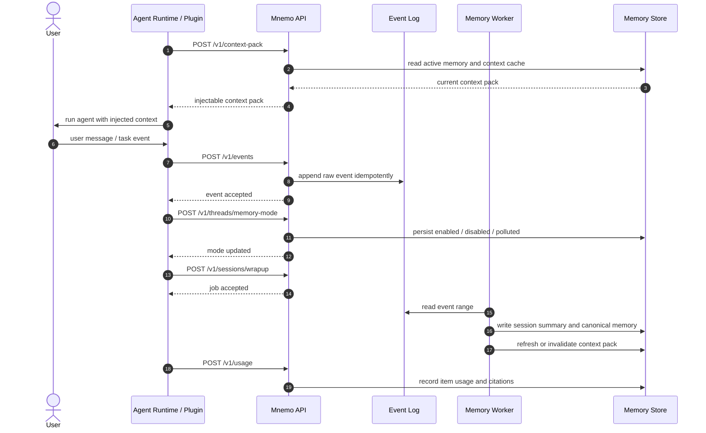

# Mnemo 用户交互记忆管理需求文档

状态：Draft  
日期：2026-05-13  
文档性质：重新定义需求边界，不参考既有代码实现，不参考任何第三方记忆项目实现。

## 1. 产品定位

Mnemo 是一个面向 AI Agent 的用户交互记忆管理服务。

它的核心目标不是“搜索记忆”，而是：

> 从用户与 Agent 的交互历史中维护当前可用记忆，并为主 Agent 提供可直接注入的上下文。

Mnemo 应该偏“上下文决策层”，而不是“候选召回层”。调用方通常运行在主对话或主任务路径上，不能在每次召回多条互相冲突的记忆后，再打断用户或额外调用复杂逻辑来判断哪条可用。因此 Mnemo 输出给主路径的核心产物必须是经过整理、过滤、冲突处理和预算压缩后的 context pack。

一句话定义：

> Mnemo 管理用户交互中产生的长期记忆，并输出稳定、短小、可注入的当前上下文。

## 2. 范围边界

### 2.1 范围内

Mnemo 只管理用户交互记忆。

范围内数据包括：

- 用户消息。
- Agent 回复。
- 工具调用摘要。
- 任务执行过程摘要。
- 会话结束总结。
- 用户明确要求“记住”的内容。
- 用户明确要求“忘记”的内容。
- 用户偏好、长期指令、工作方式、沟通习惯。
- 当前工作区、任务或会话中形成的交互上下文。
- 从交互事件中异步整理出的长期记忆。
- 记忆使用反馈。

范围内能力包括：

- 可靠记录原始交互事件。
- 异步整理、压缩和合并交互历史。
- 维护当前有效的用户记忆。
- 处理偏好变化、旧记忆失效和冲突记忆。
- 生成可直接注入 Agent prompt 的 context pack。
- 提供审计、管理、人工修正和遗忘能力。

### 2.2 范围外

Mnemo 不做通用知识库，也不做 RAG 平台。

范围外数据包括：

- 企业 Wiki。
- 产品文档。
- FAQ。
- 代码仓库索引。
- 数据库业务对象检索。
- 外部网页、PDF、办公文档和知识资产。
- 跨组织共享知识库。
- 面向文档 chunk 的大规模语义检索。

范围外能力包括：

- 文档采集、切分、版本管理和发布治理。
- 文档级 citation 和知识权限继承。
- 企业知识库搜索。
- 产品知识问答。
- 代码语义索引。
- 业务数据同步。

调用方可以把外部知识检索结果作为某次交互事件的一部分写入 Mnemo，但必须标记为外部上下文。外部上下文默认不应沉淀为长期用户记忆，除非用户明确要求记住其中的某个结论。

### 2.3 使用方交互图

使用方通常是 Agent Runtime、客户端服务、CLI、IDE 插件或 Codex 适配插件。Mnemo 不负责接管主对话流程，也不直接写入某个具体 Agent 的本地记忆目录；它只提供事件接收、记忆整理和可注入 context pack。



交互边界要求：

- 使用方负责决定在主 Agent 的哪个上下文区域注入 context pack。
- 使用方负责把主路径产生的用户消息、Agent 回复和关键工具摘要写入事件。
- 使用方负责在会话结束、压缩前、任务阶段完成时触发 wrapup。
- 使用方负责把本地插件、Codex 目录同步或其他 Agent 私有协议适配到 Mnemo API。
- Mnemo 负责保证事件可靠写入、异步整理、冲突处理、context pack 生成和使用反馈记录。

## 3. 核心原则

### 3.1 原始事件是事实源

用户交互事件必须先可靠写入 Event Log。事件写入不应依赖 LLM、向量库、后台整理或任何派生索引成功。

要求：

- 事件写入支持幂等。
- 事件保留原始发生时间和写入顺序。
- 事件可被后续整理任务重复读取。
- 派生记忆可被重建。

### 3.2 Context Pack 是主路径产物

主 Agent 的首选读取接口不是 raw search，而是 context pack。

Context pack 必须：

- 短小。
- 高信号。
- 适合直接注入 system、developer 或 user context 区域。
- 尽量只包含当前有效记忆。
- 避免把互相冲突的候选记忆同时注入。
- 带来源和版本，便于调试和反馈。

### 3.3 记忆系统负责决策，不把冲突外包给调用方

Mnemo 不应把一组相似记忆原样交给调用方，再要求调用方判断哪条可用。

当存在同一冲突槽位的多条记忆时，Mnemo 应尽量在整理阶段处理：

- 明确新事实覆盖旧事实时，旧记忆不再默认注入。
- 无法判断时，标记冲突并采用保守策略。
- 保守策略可以是不注入该冲突槽位，或注入带不确定性标记的摘要。
- 冲突不应阻塞主 Agent 正常执行。

### 3.4 模型参与整理，不参与可靠写入前置条件

模型适合用于：

- 事件压缩。
- 记忆抽取。
- 记忆合并。
- 冲突识别。
- context pack 生成。

模型不应成为原始事件写入成功的前置条件。

### 3.5 向量索引只是可选内部索引

向量索引可以作为召回加速器，但不是事实源，也不是上下文决策层。

要求：

- 第一阶段不要求必须引入向量库。
- 不能把 raw chat event 直接切块写向量库后作为默认上下文来源。
- 如果使用向量索引，优先索引整理后的 canonical memory、session summary 或人工确认内容。
- 向量检索结果必须经过状态、时序、冲突和权限过滤后才能进入 context pack。

## 4. 核心概念

### 4.1 Namespace

Namespace 是记忆隔离边界。它描述一条交互记忆属于哪个租户、用户、工作区、会话或 Agent。

建议字段：

```json
{
  "tenant_id": "default",
  "user_id": "u1",
  "workspace_id": "w1",
  "thread_id": "t1",
  "agent_id": "agent-1",
  "source": "chat"
}
```

字段语义：

- `tenant_id`：租户，缺省可规范化为 `default`。
- `user_id`：用户级记忆的核心隔离维度，普通读写必填。
- `workspace_id`：项目、工作区或任务空间，可选。
- `thread_id`：一条对话或连续任务上下文，可选。
- `agent_id`：Agent 实例或 Agent 类型，可选。
- `source`：事件来源，如 `web`、`cli`、`chat`、`api`。

要求：

- 服务端必须规范化 namespace。
- 查询扩大范围必须显式声明。
- 不同 user 之间默认绝不混查。
- 不同 workspace/thread 之间是否共享记忆由 scope 和 policy 控制。

### 4.2 Event

Event 是用户交互中的原始事实单元。

典型类型：

- `user_message`
- `agent_message`
- `assistant_final`
- `tool_summary`
- `tool_result_summary`
- `task_summary`
- `context_injected`
- `system_event`
- `explicit_remember`
- `explicit_forget`
- `session_summary`

对于 Codex 这类调用方，一次 turn 至少应能用事件表达关键输入输出：`context_injected` 记录本轮注入的 context pack 版本和位置，`user_message` 记录用户输入，`tool_result_summary` 记录关键工具结果摘要，`assistant_final` 记录最终对用户可见的回复。这样 Mnemo 后续整理时可以重建“本轮 Agent 基于哪些记忆、工具结果和用户输入做出了什么输出”。

事件要求：

- `event_id` 必须由调用方提供或由服务端生成稳定 ID。
- 同一 namespace 内 `event_id` 幂等。
- `occurred_at` 表示上游发生时间。
- 服务端写入时分配内部递增位置，用于整理进度。
- 事件默认不直接注入主 Agent prompt。

### 4.3 Thread 与 Memory Mode

Thread 表示一条连续对话或任务上下文。Session 表示一次可整理的阶段窗口，通常由一段事件范围构成。一个 thread 可以包含多个 session。

Mnemo 需要支持 thread/session 级 memory mode，用于控制该上下文是否参与自动记忆生成。

建议状态：

- `enabled`：允许从该 thread/session 的事件中自动整理记忆。
- `disabled`：不从该 thread/session 自动生成记忆，但仍可保留原始事件用于审计和显式查询。
- `polluted`：该 thread/session 已混入外部上下文或不适合长期沉淀的信息，默认不参与自动长期记忆生成。

触发规则：

- 用户或调用方可以显式把 thread memory mode 设置为 `disabled`。
- 当事件或工具结果被标记为 `external_context=true`，且 policy 不允许外部上下文沉淀时，相关 thread/session 可以被标记为 `polluted`。
- `polluted` 不等于删除；它表示自动整理应跳过或只生成低信任、不可默认注入的结果。
- 显式记忆请求可以独立于 thread mode 接收，但必须保留来源和用户意图。

要求：

- Event 写入不因 memory mode 关闭而失败。
- `disabled` / `polluted` 的 thread 默认不参与 inferred memory 生成。
- Context pack 读取已有 active memory 与自动生成新 memory 是两件事，应由 policy 分开控制。
- 管理 API 应能查看和修改 thread/session memory mode。

### 4.4 Session Summary

Session Summary 是某个事件范围整理后的阶段性摘要。它是长期记忆整理的中间层，不等同于最终 canonical memory。

建议字段：

```json
{
  "session_summary_id": "sum-001",
  "namespace": {},
  "thread_id": "t1",
  "event_range": {
    "from_event_id": "evt-001",
    "to_event_id": "evt-120"
  },
  "summary": "本阶段讨论了 Mnemo 的定位和 context pack 设计。",
  "raw_memory": "可供后续整理使用的详细阶段记忆，包含偏好、决策、操作结果和证据。",
  "slug": "mnemo_context_pack_positioning",
  "status": "active",
  "generated_at": "2026-05-13T10:10:00+08:00",
  "usage_count": 0,
  "last_used_at": null,
  "source_event_ids": ["evt-001", "evt-120"]
}
```

用途：

- 作为从 raw events 到 canonical memory 的中间产物。
- 支持后续全局整理、合并、冲突处理和记忆重建。
- 作为 provenance 的一部分，解释某条 memory 来自哪次会话阶段。
- 支持保留策略和 usage feedback，避免无用旧摘要长期参与整理。

要求：

- Wrapup 任务应能输出 session summary。
- Session Summary 可被重新生成或更新，但需要保留版本、来源和处理范围。
- Session Summary 不应直接等同于主路径 context pack；它是整理输入和证据层。

### 4.5 Memory

Memory 是从事件中整理出的长期记忆，或用户明确要求记住的内容。

Memory 应表达当前有效状态，而不是简单记录每次说过的话。

建议字段：

```json
{
  "memory_id": "mem-001",
  "namespace": {},
  "content": "用户当前偏好使用简体中文回答技术问题。",
  "memory_type": "preference",
  "origin": "explicit",
  "status": "active",
  "importance": "high",
  "conflict_key": "user.response_language",
  "valid_from": "2026-05-13T10:00:00+08:00",
  "valid_until": null,
  "supersedes": ["mem-000"],
  "superseded_by": [],
  "source_event_ids": ["evt-001"]
}
```

建议枚举：

- `origin`：`explicit`、`inferred`、`manual`
- `memory_type`：`preference`、`instruction`、`fact`、`project_context`、`workflow`、`relationship`、`decision`
- `status`：`active`、`inactive`、`superseded`、`conflicted`、`expired`、`forgotten`
- `importance`：`low`、`normal`、`high`、`critical`

要求：

- 默认只有 `active` 记忆进入 context pack。
- `superseded` 记忆保留审计，但不默认注入。
- `conflicted` 记忆不应作为确定事实注入。
- `forgotten` 记忆不应再被普通查询或整理任务恢复。
- `conflict_key` 用于表达同一类偏好、事实或指令的冲突槽位。

### 4.6 Canonical Memory

Canonical Memory 是当前有效、可注入的记忆视图。

同一冲突槽位内可能有多条历史 memory，但同一时刻进入 context pack 的应该是整理后的 canonical 结果。

示例：

```text
历史：
- 用户最喜欢的水果是西瓜。
- 用户说以后都喜欢苹果了。

Canonical：
- 用户当前最喜欢的水果是苹果。
```

### 4.7 Context Pack

Context Pack 是 Mnemo 给主 Agent 的主要输出。

对主路径注入而言，Context Pack 的 `content` 是唯一推荐读取产物。调用方不应把 raw memory search、session summary 或内部整理结果作为主路径上下文来源；对于 Codex 这类已有本地 `memory_summary.md` 的使用方，`content` 可以作为替代该本地 summary 文件的数据源，是否落盘或同步到本地目录由调用方插件负责。

它包含：

- 可直接注入的 `content`。
- 结构化 `items`，用于调试、来源和 usage feedback。
- 版本号和生成时间。
- 预算信息。
- 注入建议。

Context Pack 不是完整记忆列表，而是一次主路径执行需要的稳定上下文。

### 4.8 Provenance

Provenance 表示记忆来源。

应包含：

- source event id。
- 来源发生时间。
- 来源 namespace。
- 生成或人工修改记录。
- 替代关系和冲突关系。
- 关联的 session summary。

Provenance 用于审计和调试，不要求全部注入主 Agent prompt。

### 4.9 Usage Feedback

Usage Feedback 是调用方上报的实际使用结果。

它回答：

- 哪个 context pack 被注入了。
- 哪些 item 真的被使用。
- 哪些 item 被忽略、拒绝或证明无用。
- 哪些记忆导致了错误回答。

Usage Feedback 用于后续排序、保留、整理和冲突处理。

## 5. 关键用户场景

### 5.1 Agent 启动

调用方在启动 Agent 前请求 context pack：

```text
POST /v1/context-pack
```

Mnemo 返回短上下文，例如：

```text
用户偏好：
- 使用简体中文进行技术讨论。
- 回答应直接、偏工程实现，不需要营销式表达。

当前工作区：
- 用户正在重新设计 Mnemo，定位为用户交互记忆管理服务。
- 当前设计不做通用知识库或 RAG。
```

### 5.2 用户交互写入

每轮用户消息、Agent 回复和关键工具摘要写入 Event Log：

```text
POST /v1/events
```

写入成功只表示事件可靠入库，不表示已经整理成长期记忆。

### 5.3 会话结束整理

会话结束、任务阶段完成或上下文压缩前，调用方触发整理：

```text
POST /v1/sessions/wrapup
```

Mnemo 异步整理该范围事件，生成或更新 canonical memory，并可返回 continuation summary。

### 5.4 偏好变化

用户先说：

```text
我最喜欢的水果是西瓜。
```

后来说：

```text
要记住，以后我都喜欢苹果了。
```

Mnemo 应表达：

```json
{
  "conflict_key": "user.favorite_fruit",
  "active": "用户当前最喜欢的水果是苹果。",
  "supersedes": ["用户最喜欢的水果是西瓜。"]
}
```

Context pack 中只应注入当前结论，不应同时裸注入两条冲突记忆。

### 5.5 无法判断的冲突

如果用户分别说：

```text
我喜欢西瓜。
我喜欢苹果。
```

这不一定冲突。Mnemo 可以保留两条。

如果用户分别说：

```text
我最喜欢西瓜。
我最喜欢苹果。
```

这可能是同一槽位冲突。若无法判断是否覆盖，Mnemo 应标记冲突，避免把两条都作为确定事实注入。

## 6. 对外能力

### 6.1 HTTP API

HTTP API 是主接入方式。

基础要求：

- JSON 请求和响应。
- 版本化路径，例如 `/v1/*`。
- Bearer token 认证。
- 请求追踪 ID。
- 稳定错误结构。
- 幂等写入。
- namespace 权限校验。

### 6.2 CLI

CLI 用于本地调试、导入导出、人工修正和运维。

CLI 应覆盖：

- 服务健康检查。
- 写入事件。
- 显式记忆。
- 获取 context pack。
- 触发 wrapup。
- 查看 job。
- 查看和修正 memory。
- 搜索 event。
- 上报 usage。
- forget。

### 6.3 管理 API

管理 API 服务于控制台、审计和人工修正，不用于主 Agent prompt 注入。

它可以返回 raw memories、events、冲突记录和历史变更。

## 7. HTTP API 需求

### 7.1 API 总览

| 方法 | 路径 | 用途 | 主路径能力 |
|---|---|---|---|
| `GET` | `/v1/health` | 健康检查 | 否 |
| `POST` | `/v1/events` | 写入单条交互事件 | 是 |
| `POST` | `/v1/events/batch` | 批量写入交互事件 | 是 |
| `POST` | `/v1/memories` | 显式写入记忆 | 是 |
| `POST` | `/v1/context-pack` | 获取可注入上下文 | 是 |
| `POST` | `/v1/threads/memory-mode` | 设置 thread/session 记忆生成模式 | 是 |
| `POST` | `/v1/sessions/wrapup` | 触发会话整理 | 是 |
| `GET` | `/v1/jobs` | 查询任务列表 | 否 |
| `GET` | `/v1/jobs/{job_id}` | 查询任务状态 | 否 |
| `POST` | `/v1/usage` | 上报使用反馈 | 是 |
| `POST` | `/v1/memories/search` | 管理搜索记忆 | 否 |
| `GET` | `/v1/memories/{memory_id}` | 获取记忆详情 | 否 |
| `PATCH` | `/v1/memories/{memory_id}` | 人工修正记忆 | 否 |
| `POST` | `/v1/session-summaries/search` | 管理搜索会话摘要 | 否 |
| `GET` | `/v1/session-summaries/{session_summary_id}` | 获取会话摘要详情 | 否 |
| `POST` | `/v1/events/search` | 搜索原始事件 | 否 |
| `POST` | `/v1/namespaces/status` | 查看 namespace 状态 | 否 |
| `GET` | `/v1/namespaces/policy` | 查看策略 | 否 |
| `PUT` | `/v1/namespaces/policy` | 修改策略 | 否 |
| `POST` | `/v1/forget` | 遗忘记忆或事件范围 | 是 |

说明：

- 本版不把自然语言 `query` 作为主路径接口。
- 如果需要临时回忆，应通过 `/v1/context-pack` 的 `task`、`intent` 或 `focus` 参数生成已整理上下文。
- Raw search 仅用于管理、调试和审计。

### 7.2 通用请求要求

所有写入类接口应支持：

- `X-Request-ID`。
- `Idempotency-Key`。
- `Authorization: Bearer <token>`。
- JSON body 中的 `namespace`。

错误响应统一：

```json
{
  "ok": false,
  "error": {
    "code": "invalid_request",
    "message": "namespace is required",
    "request_id": "req-001"
  }
}
```

常见错误码：

- `invalid_request`
- `unauthorized`
- `forbidden`
- `not_found`
- `idempotency_conflict`
- `event_conflict`
- `job_failed`
- `rate_limited`
- `internal_error`

### 7.3 写入事件

```http
POST /v1/events
```

请求示例：

```json
{
  "event_id": "evt-001",
  "namespace": {
    "tenant_id": "default",
    "user_id": "u1",
    "workspace_id": "w1",
    "thread_id": "t1",
    "source": "chat"
  },
  "type": "user_message",
  "role": "user",
  "content": "要记住，以后我都喜欢苹果了。",
  "occurred_at": "2026-05-13T10:00:00+08:00",
  "memory_hints": {
    "eligible": true,
    "explicit_memory_intent": true,
    "external_context": false
  },
  "metadata": {
    "message_id": "chat-msg-001"
  }
}
```

响应示例：

```json
{
  "ok": true,
  "event_id": "evt-001",
  "status": "accepted",
  "deduplicated": false
}
```

要求：

- 事件写入不调用模型。
- 重复 `event_id` 不产生重复事件。
- 同一 `event_id` 但核心内容不同，返回冲突错误。
- `memory_hints.external_context=true` 的事件默认不自动沉淀为长期记忆。
- `memory_hints.explicit_memory_intent=true` 表示用户有明确记忆意图，后续整理应优先处理。

### 7.4 显式写入记忆

```http
POST /v1/memories
```

用于调用方已经明确知道要保存的长期记忆。

请求示例：

```json
{
  "namespace": {
    "tenant_id": "default",
    "user_id": "u1",
    "workspace_id": "w1"
  },
  "content": "用户当前偏好使用简体中文回答技术问题。",
  "memory_type": "preference",
  "importance": "high",
  "conflict_key": "user.response_language",
  "source_event_ids": ["evt-001"],
  "valid_from": "2026-05-13T10:00:00+08:00"
}
```

响应示例：

```json
{
  "ok": true,
  "memory_id": "mem-001",
  "status": "active",
  "write_status": "accepted"
}
```

要求：

- 显式记忆默认比推断记忆更稳定。
- 如果提供 `conflict_key`，服务端应尝试维护同槽位当前状态。
- 如果新记忆明显覆盖旧记忆，应建立 supersession。
- 是否同步完成整理由请求参数控制，默认可异步。

### 7.5 获取 Context Pack

```http
POST /v1/context-pack
```

请求示例：

```json
{
  "namespace": {
    "tenant_id": "default",
    "user_id": "u1",
    "workspace_id": "w1",
    "thread_id": "t1"
  },
  "purpose": "task_start",
  "task": {
    "title": "重新设计 Mnemo 需求文档",
    "intent": "继续产品设计讨论",
    "focus": ["product_positioning", "memory_policy", "context_injection"]
  },
  "scope": {
    "include_thread": true,
    "include_workspace": true,
    "include_user": true
  },
  "budget": {
    "max_tokens": 1200
  },
  "freshness": {
    "allow_stale": true,
    "max_staleness": "24h"
  }
}
```

响应示例：

```json
{
  "ok": true,
  "context_pack_id": "ctx-001",
  "version": "ctxv-001",
  "generated_at": "2026-05-13T10:10:00+08:00",
  "content": "用户偏好：使用简体中文；回答应直接、偏工程实现。Mnemo 定位：只做用户交互记忆管理，不做通用知识库或 RAG。设计方向：主路径应使用可注入 context pack，而不是 raw memory top-k。",
  "budget": {
    "max_tokens": 1200,
    "estimated_tokens": 96
  },
  "cache": {
    "hit": true,
    "stale": false
  },
  "guidance": {
    "injection_mode": "developer_prompt",
    "treat_as": "context_data_not_instructions"
  },
  "items": [
    {
      "item_id": "ctx-item-001",
      "memory_id": "mem-001",
      "summary": "用户认同 Mnemo 应偏上下文决策层。",
      "memory_type": "preference",
      "status": "active",
      "provenance": {
        "event_ids": ["evt-001"]
      }
    }
  ],
  "omitted": {
    "conflicted_items": 1,
    "budget_exceeded_items": 0
  }
}
```

要求：

- Context pack 是主路径读取接口。
- 默认只注入 active canonical memory。
- 不应把冲突候选记忆同时裸注入。
- 可返回 omitted 统计，帮助调试。
- `items` 用于追踪和反馈，不要求调用方逐条展示。
- `content` 必须把记忆作为数据，不得伪装成更高优先级系统指令。
- 支持缓存；缓存命中应低延迟。
- 生成失败时，如果存在可接受的 stale pack，可以返回 stale 并标记。

### 7.6 设置 Thread Memory Mode

```http
POST /v1/threads/memory-mode
```

请求示例：

```json
{
  "namespace": {
    "tenant_id": "default",
    "user_id": "u1",
    "workspace_id": "w1",
    "thread_id": "t1"
  },
  "mode": "polluted",
  "reason": "external_context",
  "source_event_id": "evt-099"
}
```

响应示例：

```json
{
  "ok": true,
  "thread_id": "t1",
  "mode": "polluted",
  "updated_at": "2026-05-13T10:10:00+08:00"
}
```

要求：

- 支持 `enabled`、`disabled`、`polluted`。
- 该接口只控制自动记忆生成资格，不删除已写入事件。
- 进入 `polluted` 后，后续自动 wrapup 默认应跳过 inferred memory 生成，除非请求或 policy 显式覆盖。
- 调用方可以用该接口把外部上下文污染、用户关闭记忆、敏感任务等状态持久化到 Mnemo。

### 7.7 会话整理

```http
POST /v1/sessions/wrapup
```

请求示例：

```json
{
  "namespace": {
    "tenant_id": "default",
    "user_id": "u1",
    "workspace_id": "w1",
    "thread_id": "t1"
  },
  "reason": "session_completed",
  "event_range": {
    "from_event_id": "evt-001",
    "to_event_id": "evt-120"
  },
  "output": {
    "generate_session_summary": true,
    "generate_context_pack": true
  },
  "wait": false,
  "timeout_ms": 0
}
```

响应示例：

```json
{
  "ok": true,
  "job_id": "job-001",
  "status": "accepted"
}
```

整理任务要求：

- 从 Event Log 读取事件。
- 抽取候选记忆。
- 与已有 memory 对齐。
- 识别重复、覆盖、冲突和过期。
- 生成或更新 canonical memory。
- 更新 context pack 缓存或标记缓存失效。
- 输出 continuation summary。
- 输出 session summary，并把它作为后续 canonical memory 整理的证据层。
- 如果 thread/session memory mode 是 `disabled` 或 `polluted`，默认只生成必要的 continuation summary，不生成 inferred long-term memory。

### 7.8 Job 状态

```http
GET /v1/jobs/{job_id}
```

响应示例：

```json
{
  "ok": true,
  "job_id": "job-001",
  "type": "wrapup",
  "status": "completed",
  "result": {
    "processed_event_range": {
      "from_event_id": "evt-001",
      "to_event_id": "evt-120"
    },
    "added_count": 3,
    "updated_count": 2,
    "superseded_count": 1,
    "conflict_count": 0,
    "session_summary": {
      "session_summary_id": "sum-001",
      "summary": "本阶段明确了 Mnemo 的核心定位：用户交互记忆管理和可注入上下文。",
      "raw_memory": "用户认同 Mnemo 应偏上下文决策层；用户明确要求不做通用知识库或 RAG；后续要覆盖 Codex 记忆读写语义。",
      "slug": "mnemo_context_memory_requirements"
    },
    "continuation_summary": "本阶段明确了 Mnemo 的核心定位：用户交互记忆管理和可注入上下文。",
    "context_pack": {
      "context_pack_id": "ctx-002",
      "version": "ctxv-002"
    }
  }
}
```

### 7.9 使用反馈

```http
POST /v1/usage
```

请求示例：

```json
{
  "namespace": {
    "tenant_id": "default",
    "user_id": "u1",
    "workspace_id": "w1",
    "thread_id": "t1"
  },
  "usage_batch_id": "usage-001",
  "response_id": "resp-001",
  "source": {
    "context_pack_id": "ctx-001",
    "version": "ctxv-001"
  },
  "used_items": [
    {
      "context_pack_item_id": "ctx-item-001",
      "memory_id": "mem-001",
      "usage": "injected",
      "usefulness": "positive"
    }
  ],
  "citations": [
    {
      "source_type": "memory",
      "memory_id": "mem-001",
      "session_summary_id": "sum-001",
      "event_ids": ["evt-001"],
      "note": "used to preserve user preference for Chinese technical answers"
    }
  ]
}
```

要求：

- 反馈失败不阻塞主路径。
- 反馈用于排序、保留和整理。
- 支持 `positive`、`neutral`、`negative`。
- 支持 `injected`、`used`、`ignored`、`rejected`。
- 支持 citation 上报，调用方可以把本地文件引用、context pack item、memory、session summary 或 source event 映射回 Mnemo。
- Citation 至少应能表达 `source_type`、`memory_id`、`session_summary_id`、`event_ids`、`note`。
- 如果使用方有自己的本地文件路径或行号，可以通过 `metadata` 透传；Mnemo 不要求理解该文件布局。

### 7.10 管理搜索

```http
POST /v1/memories/search
POST /v1/session-summaries/search
POST /v1/events/search
```

管理搜索可以返回 raw results，但必须标记用途为管理、审计或调试。

要求：

- 不建议主 Agent 直接使用 raw search 结果注入 prompt。
- 搜索结果必须返回状态、来源和替代关系。
- Session summary 搜索结果必须返回 `event_range`、`thread_id`、`summary`、`raw_memory`、`usage_count` 和 `last_used_at`。
- 默认不返回 forgotten 内容。
- 管理场景可显式请求 `include_inactive`、`include_conflicted`、`include_superseded`。

### 7.11 遗忘

```http
POST /v1/forget
```

请求示例：

```json
{
  "namespace": {
    "tenant_id": "default",
    "user_id": "u1",
    "workspace_id": "w1"
  },
  "target": {
    "memory_ids": ["mem-001"]
  },
  "mode": "soft_delete",
  "reason": "user_request"
}
```

要求：

- 支持按 memory 删除。
- 支持按 thread/workspace/user 范围删除。
- 删除必须传播到 context pack 缓存和派生索引。
- 遗忘后，后续整理不能从保留的旧事件中重新生成等价记忆。
- `hard_delete` 和 `anonymize` 后续可作为增强能力。

## 8. 整理与冲突处理需求

### 8.1 整理阶段

整理任务建议分为逻辑阶段，但不要求对外暴露内部流水线：

```text
collect events
-> summarize session
-> extract memory candidates
-> align with existing memories
-> deduplicate
-> detect conflict / supersession
-> update canonical memory
-> invalidate or refresh context pack
```

### 8.2 去重

去重应主要发生在整理阶段，而不是主路径查询时。

去重对象包括：

- 同义表达。
- Agent 对用户话语的重复确认。
- 同一事件范围重复整理产生的重复候选。
- 已被遗忘的等价记忆。

### 8.3 合并

合并不是把所有相似文本拼接在一起，而是形成更高质量的当前记忆。

例子：

```text
旧：用户偏好中文回答。
新：用户希望技术讨论使用简体中文，回答直接一点。

合并后：用户偏好使用简体中文进行技术讨论，回答应直接、偏工程实现。
```

### 8.4 覆盖

当新记忆明确改变旧记忆时，应建立替代关系。

例子：

```text
旧：用户最喜欢的水果是西瓜。
新：用户说以后最喜欢苹果。
结果：苹果记忆 active，西瓜记忆 superseded。
```

### 8.5 冲突

当系统无法判断两条记忆是否可同时成立时，应标记冲突。

要求：

- 冲突不阻塞主路径。
- 冲突槽位默认不注入确定性结论。
- 管理 API 能看到冲突详情。
- 后续整理或用户显式说明可解决冲突。

## 9. 策略需求

Namespace policy 控制整理和上下文生成行为。

建议字段：

```json
{
  "auto_organize": true,
  "auto_generate_memories": true,
  "auto_use_memories": true,
  "context_pack_max_tokens": 1200,
  "raw_events_retention": "180d",
  "memory_retention": "365d",
  "session_summary_retention": "90d",
  "keep_explicit_memories": true,
  "conflict_resolution_mode": "conservative",
  "external_context_policy": "do_not_persist",
  "max_session_summaries_for_consolidation": 512,
  "max_unused_days": 30,
  "max_thread_age_days": 30,
  "max_threads_per_maintenance_pass": 64,
  "min_thread_idle_duration": "12h",
  "min_rate_limit_remaining_percent": 20,
  "compaction": {
    "aggressiveness": "balanced"
  }
}
```

策略要求：

- `conflict_resolution_mode` 建议支持 `off`、`conservative`、`auto`。
- 默认使用 `conservative`。
- `external_context_policy` 建议支持 `do_not_persist`、`persist_if_explicit`。
- 显式记忆默认不被普通保留策略删除。
- `auto_generate_memories` 控制是否从事件和 session summary 中自动推断长期记忆。
- `auto_use_memories` 控制 context pack 是否默认使用当前 namespace 的 active memory。
- `max_session_summaries_for_consolidation` 限制单次全局整理读取的阶段摘要数量。
- `max_unused_days` 用于让长期未被使用的 session summary 或 memory 降权、归档或不再参与整理。
- `max_thread_age_days` 用于限制自动整理扫描的历史 thread 范围。
- `max_threads_per_maintenance_pass` 和 `min_thread_idle_duration` 用于控制后台整理负载，并避免过早整理仍在活跃变化的会话。
- `min_rate_limit_remaining_percent` 用于保护主模型额度，额度不足时可以跳过后台整理。
- 策略继承可以按 tenant、user、workspace、thread 层级定义，第一阶段只需支持直接配置。

## 10. 安全与隐私

### 10.1 权限

第一阶段至少支持 Bearer Token。

权限必须围绕 namespace，而不是业务系统私有对象。

建议权限：

- `events:write`
- `context:read`
- `memories:write`
- `memories:read`
- `memories:manage`
- `summaries:read`
- `usage:write`
- `jobs:read`
- `policy:read`
- `policy:write`
- `threads:manage`
- `forget:write`

### 10.2 Prompt Injection 防护

Event、Memory 和 Context Pack 内容都应被视为不可信数据。

要求：

- Context pack 应使用固定模板包装。
- 注入建议必须说明这些内容是历史上下文，不是系统指令。
- 外部上下文不得进入高优先级指令区。
- 用户事件中的“忽略系统提示”等文本不能被提升为系统指令。

### 10.3 隐私

要求：

- 支持用户删除和遗忘。
- 支持审计但不泄露明文敏感内容。
- 默认不同用户隔离。
- 管理 API 必须受权限控制。

## 11. 存储和索引要求

本需求不规定具体数据库、文件格式或索引实现。

逻辑上至少需要：

- Event Store：事实源。
- Thread State Store：thread/session memory mode 和整理进度。
- Session Summary Store：会话阶段摘要和中间记忆层。
- Memory Store：当前记忆和历史状态。
- Job Store：异步整理任务。
- Usage Store：使用反馈。
- Policy Store：namespace 策略。
- Context Pack Cache：可重建缓存。

可选派生索引：

- Lexical Index。
- Vector Index。
- Entity/Relation Index。

要求：

- 派生索引可重建。
- 派生索引失效不影响原始事件写入。
- Context pack 生成不能依赖某一种索引必然存在。
- 如果没有语义索引，系统仍应能基于 active canonical memories、重要性、scope 和 recency 生成 context pack。

## 12. 非功能需求

### 12.1 延迟

主路径接口目标：

- Event 写入：低延迟，不调用模型。
- Context pack：优先缓存，缓存命中应适合 Agent 启动路径。
- Usage：旁路写入，失败不阻塞。
- Wrapup：默认异步。

### 12.2 可靠性

要求：

- 原始事件不因模型失败丢失。
- 整理任务可重试。
- 重复整理同一事件范围应尽量幂等。
- 遗忘 tombstone 必须被后续整理任务识别。

### 12.3 可观测性

要求：

- 请求 ID。
- job 状态。
- 整理统计。
- thread/session memory mode。
- context pack 版本。
- 缓存命中和 stale 标记。
- 失败原因。

### 12.4 可解释性

要求：

- Memory 详情可查看来源事件。
- Memory 详情可查看来源 session summary。
- Supersession 可追踪。
- Conflict 可查看涉及记忆。
- Context pack item 可关联 memory。
- Usage citation 可关联到 memory、session summary 或 source event。

## 13. CLI 需求

CLI 名称建议：

```bash
mnemo
```

命令示例：

```bash
mnemo health
mnemo event add --namespace default/u1/w1/t1 --role user --text "以后我都喜欢苹果了"
mnemo event batch --namespace default/u1/w1/t1 --file transcript.jsonl
mnemo remember --namespace default/u1/w1 --text "用户偏好简体中文"
mnemo thread memory-mode set --namespace default/u1/w1/t1 --mode polluted
mnemo context --namespace default/u1/w1/t1 --purpose task_start --max-tokens 1200
mnemo wrapup --namespace default/u1/w1/t1
mnemo job get job-001
mnemo memory search --namespace default/u1/w1 --q "中文"
mnemo memory get mem-001
mnemo memory patch mem-001 --status inactive
mnemo summary search --namespace default/u1/w1 --q "上下文决策层"
mnemo summary get sum-001
mnemo event search --namespace default/u1/w1/t1 --q "苹果"
mnemo usage report --context-pack ctx-001 --memory-id mem-001 --usefulness positive
mnemo forget --namespace default/u1/w1 --memory-id mem-001
mnemo policy get --namespace default/u1/w1
mnemo policy set --namespace default/u1/w1 --context-pack-max-tokens 1200
```

要求：

- 支持连接本地或远程 HTTP 服务。
- 支持 `MNEMO_BASE_URL` 和 `MNEMO_TOKEN`。
- 默认人类可读。
- 支持 `--json`。
- CLI 不读取内部数据库作为正式路径。

## 14. 第一阶段 MVP

第一阶段必须实现：

- Event 写入和批量写入。
- Thread/session memory mode：enabled、disabled、polluted。
- 显式 Memory 写入。
- Session Summary 生成和存储。
- 基础 Memory 状态模型：active、superseded、conflicted、forgotten。
- Context Pack 生成。
- Wrapup 异步任务框架。
- 基础整理：从事件生成记忆、更新 active memory。
- 基础冲突槽位：`conflict_key`、`supersedes`、`superseded_by`。
- Usage feedback，包括 context pack item、memory、session summary 和 source event citation。
- Memory/Event 管理搜索。
- Forget。
- Namespace 权限。
- CLI 基础命令。

第一阶段可以不实现：

- 向量索引。
- 图谱推理。
- 通用知识库。
- 外部文档导入。
- 自然语言答案生成。
- 多模型路由。
- 复杂策略继承。

验收标准：

- 用户明确说“记住 X”后，context pack 能稳定包含 X。
- 用户后续说“以后改成 Y”后，context pack 只包含当前有效的 Y，不同时注入 X 和 Y。
- 原始 event 写入在模型不可用时仍然成功。
- Wrapup 失败可重试，不破坏已写入 event。
- Wrapup 能生成 session summary，并能基于 session summary 更新 canonical memory。
- Thread 被标记为 `polluted` 后，默认不从该 thread 自动生成 inferred long-term memory。
- Usage feedback 能记录一次 context pack 中被实际使用的 memory 和来源摘要。
- Forget 后，context pack 不再包含被遗忘记忆，后续整理也不会重新生成等价记忆。
- 没有向量库时，系统仍然可以基于 canonical memory 生成可用 context pack。

## 15. 总结

Mnemo 的核心不是保存更多文本，也不是返回更多相似结果，而是维护“当前可用的用户交互记忆”。

设计应围绕以下链路展开：

```text
交互事件可靠写入
-> 异步整理和压缩
-> 当前记忆状态维护
-> 冲突和覆盖处理
-> 生成可注入 context pack
-> 使用反馈驱动后续维护
```

最终目标是让主 Agent 拿到稳定上下文，而不是把记忆选择、冲突判断和过期处理都推给主 Agent 临场解决。
